**软件项目管理**

# 1. 软件项目管理

## 1.1 概述

### 概念

> 项目是为了创造一个唯一的产品或提供一个唯一的服务而进行的临时性的努力

### 软件项目特征

* 目标性

* 相关性

* 周期性 

* 独特性

  没有完全一样的项目”，项目的这种独特性对实际项目管理有非常重要的指导意义，因此软件的项目管理业具备了一定的独特性。

* 约束性 

* 不确定性 

  软件项目是抽象的，因此软件项目的管理具有不确定性

*  结果的不可逆转性

**项目的三大特点：临时性、独特性和渐进明细性。**

### 软件项目和日常运作区别

* 项目是一次性的，日常运作是重复进行的
* 项目是以目标为导向的，日常运作是通过效率和有效性体现的
* 项目是通过与项目经理及其团队工作完成的，而日常运作是职能式的线形管理
* 大量的变更管理，而日常运作则基本保持持续的连贯性的
* 软件是逻辑实体，不是具体的物理实体，具有抽象性
* 软件的开发受计算机系统的限制，对硬件系统有不同程度的依赖
*  软件具有复杂性特点，其开发成本昂贵，制约因素很多

### 项目管理

> 项目管理是以项目为对象，通过使用知识、技能、工具和方法来组织、计划、实施并监控项目，使之满足项目目标需求的过程。

#### 项目管理的三个约束条件

* 项目的范围约束
  项目的范围就是规定项目的任务是什么?作为项目经理，首先必须搞清楚项目的商业利润核心，明确把握项目发起人期望通过项目获得什么样的产品或服务。对于项目的范围约束，容易忽视项目的商业目标，而偏向技术目标，导致项目最终结果与项目干系人期望值之间的差异。
  因为项目的范围可能会随着项目的进展而发生变化，从而与时间和成本等约束条件之间产生冲突，因此面对项目的范围约束，主要是根据项目的商业利润核心做好项目范围的变更管理。既要避免无原则的变更项目的范围，也要根据时间与成本的约束，在取得项目干系人的一致意见的情况下，合理的按程序变更项目的范围。

* 项目的时间约束
  项目的时间约束就是规定项目需要多长时间完成，项目的进度应该怎样安排，项目的活动在时间上的要求，各活动在时间安排上的先后顺序。当进度与计划之间发生差异时，如何重新调整项目的活动历时，以保证项目按期完成，或者通过调整项目的总体完成工期，以保证活动的时间与质量。在考虑时间约束时，一方面要研究因为项目范围的变化对项目时间的影响，另一方面要研究，因为项目历时的变化，对项目成本产生的影响。并及时跟踪项目的进展情况，通过对实际项目进展情况的分析，提供给项目干系人一个准确的报告。

* 项目的成本约束

  项目的成本约束就是规定完成项目需要花多少钱。对项目成本的计量，一般用花费 多少资金来衡量，但也可以根据项目的特点，采用特定的计量单位来表示。关键是通过成本核算，能让项目干系人，了解在当前成本约束之下，所能完成的项目范围及时间要求。当项目的范围与时间发生变化时，会产生多大的成本变化，以决定是否变更项目的范围，改变项目的进度，或者扩大项目的投资。
  在我们实际完成的许多项目中，多数只重视项目的进度，而不重视项目的成本管理。一般只是在项目结束时，才交给财务或计划管理部门的预算人员进行项目结算。对内部消耗资源性的项目，往往不做项目的成本估算与分析，使得项目干系人根本认识不到项目所造成的资源浪费。因此，对内部开展的一些项目，也要进行成本管理。

## 1.2 必要性

无规则、混乱的开发状态，进度滞后，费用超支等失败的例子很多
业务失败，合同纠纷，法律诉讼，客户投诉等困扰软件业。

### 软件危机
* 软件生产能力和业务发展需求不相适应的现象
* 就是弱的软件生产能力和强的业务发展需求之间的矛盾

### 软件危机表现

* 开发过程随心所欲
* 时间计划和费用估算缺乏现实的基础
* 管理者主要在应付突发事件
* 对产品质量缺乏客观基础
* 软件开发的成败建立在个人能力基础上

## 1.3 软件项目生命期与管理过程

### 1.3.1 生命期

#### 六个周期

* 计划阶段   定义系统，确定用户的要求或总体研究目标，提出可行的方案，包括资源、成本、效益、进度等的实施计划。进行可行性分析并制定粗略计划。
* 需求分析阶段   确定软件的功能、性能、可靠性、接口标准等要求，根据功能要求进行数据流程分析，提出初步的系统逻辑模型，并据此修改项目实施计划。
* 软件设计阶段   它包括系统概要设计和详细设计。在概要设计中，要建立系统的整体结构，进行模块划分，根据要求确定接口。在详细设计中，要建立算法、数据结构和流程图。 
* 编码阶段   把流程图翻译成程序，并对程序进行调试。
* 测试阶段   通过单元测试，检验模块内部的结构和功能；通过集成测试，把模块连接成系统，重点寻找接口上可能存在的问题；确认测试，即按照需求的内容逐项进行测试；系统测试，就是到实际的使用环境中进行测试。单元测试和集成测试由开发者自己完成，确认测试和系统测试则由用户参与完成。
* 运行维护阶段   它一般包括三类工作，为了修改错误而做的改正性维护；为了适应环境变化而做的适应性维护；为了适应用户新的需求而做的完善性维护，有时会成为二次开发，进入一个新的生命期，再从计划阶段开始。 

> 简述:
>
> 概念（Concept）
> 开发（Development）
> 实施（Implementation）
> 结束（Termination）

#### 影响

#### 注意点

* 检查点(Check Point) 它指在规定的时间间隔内对项目进行检查，比较实际现状与计划之间的差异，并根据差异进行调整
* 里程碑(Mile Stone)  它是完成阶段性工作的标志，不同类型的项目里程碑不同 
* 基线(Base Line)  它指一个(或一组)配置项在项目生命期的不同时间点上，通过正式评审而进入正式受控的一种状态  

### 1.3.2 管理过程

启动--> 计划--> 控制---> 结束

计划和控制为重点

#### 主要工作

* 制定技术目标
* 组建项目组
* 制订项目计划
* 处理范围变化
* 控制实际进展
* 整理、完善技术档案
* 形成知识网络

# 2. 软件合同管理

## 2.1 概述

### 1. 定义

> 合同是使卖方负有提供具体产品和服务的责任，买方负有为该产品和产品服务付款的责任的一种双方相互负有义务的协议。

* 合同定义了合同签署方的权利与义务，以及违背协议会造成的相应法律后果；
* 合同监督项目执行的各方履行其权利和义务，它是具有法律效力的文件；围绕合同，存在合同签署之前和合同签署之后的一系列工作。 

### 2. 技术合同

**软件项目合同主要是技术合同**

> 技术合同是法人之间、法人和公民之间、公民之间以技术开发、技术转让、技术咨询和技术服务为内容，明确相互权利义务关系所达成的协议；
>
> 技术合同有三种环境：需（甲）方环境、供（乙）方环境和内部环境；
> 技术合同一般包括主合同和合同附件。 

### 3. 技术合同内容

* 项目名称；
* 项目的技术内容、范围、形式和要求；
* 项目实施计划、进度、期限、地点和方式；
* 项目合同价款、报酬及其支付方式；
* 项目验收标准和方法；
* 各方当事人义务或协作责任；
* 技术成果归属和分享及后续改进的提供与分享规定；
* 技术保密事项；
* 风险责任的承担；
* 违约金或者损失赔偿额的计算方法、仲裁及其它。 

### 4. 技术合同附件

* 系统的商务报价表；
* 系统的需求规格说明书；
* 项目的工程进度计划书；
* 技术服务承诺；
* 培训计划；
* 移交的用户文档和技术文档；
* 场地和环境准备要求；
* 测试与验收标准；
* 初验与终验报告样式范本；
* 工程实施的分工界面定义。

### 5. 合同生存周期

* 合同准备
* 合同签署
* 合同管理
* 合同终止

## 2.2 需方合同环境(甲方)

> 企业在需方合同环境下，关键要素是提供准确、清晰和完整的需求，选择合格的供方并对采购对象（采购对象包括产品服务、人力资源等）进行必要的验收。
> 这个需求可能来自于企业内部的需要，也可能是在为客户开发的软件项目中的一部分，通过寻找合适的软件开发商，将部分软件外包给其他的开发商。

### 合同准备

* 招标书定义(采购需求定义)  启动一个项目主要是由于存在一种需求，招标书定义主要是需方的需求定义，也就是甲方(买方)定义采购的内容。 

  **招标书主要内容可分为三大部分：程序条款、技术条款、商务条款。**

  包含下列主要九项内容：1、招标邀请函;2、投标人须知;3、招标项目的技术要求及附件;4、投标书格式;5、投标保证文件;6、合同条件(合同的一般条款及特殊条款);7、技术标准、规范;8、投标企业资格文件;9、合同格式。

  

  > 流程如下：
  >
  > 需方申请
  >
  > 需求定义
  >
  > 商务条件确定
  >
  > 验收标准确定
  >
  > 资料汇集
  >
  > 采购需求认可
  >
  > 编写招标文件
  >
  > 招标文件

* 供方选择  招标文件确定后，就可以通过招标的方式选择供方（乙方或者卖方）。 

  > 流程如下：
  >
  > 招标文件
  >
  > 招标
  >
  > 手机供方的建议书
  >
  > 评定供方
  >
  > 最终供方确定
  >
  > 供方名单
  >
  > 建议书

* 合同文本准备   如果需方选择了合适的供方（软件开发商），需方应该与供方（软件开发商）签订一个具有法律效力的合同；签署合同之前需要起草一份合同文本。 

  > 采购资料
  >
  > 合同草案指定
  >
  > 合同草案评审
  >
  > 合同草案修订
  >
  > 合同草案确定
  >
  > 合同草案

### 合同签署

> 合同签署过程就是正式签署合同，使之成为具有法律效力的文件；
> 同时，根据签署的合同，分解出合同中需方(甲方)的任务，并下达任务书，指派相应的项目经理负责相应的过程。 

* 合同草案
* 谈判日程确定
* 合同草案提交
* 合同条款协商
* 合同签署文本确定
* 合同签署文本审阅
* 合同签署
* 合同签署文本
* 任务书下达

### 合同管理

>  对于企业处于需方(甲方)的环境，合同管理是需方对供方(乙方)执行合同的情况进行监督的过程，

主要包括：
对需求对象（采购对象）的验收  验收过程是需方对供方交付的产品或服务进行验收检验，以保证它满足合同条款的要求。
对违约事件处理  在合同的执行过程中，如果供方发生与合同要求不一致的问题，导致违约事件，需要执行违约事件处理过程。

**验收过程**

**违约处理**

### 合同终止

> 当项目满足结束的条件，项目经理或者合同管理者应该及时宣布项目结束，终止合同的执行，通过合同终止过程告知各方合同终止

**过程**

* 合同
* 合同相关文档归档
* 合同终止通知
* 项目执行总结
* 项目总结

## 2.3 供方合同环境(乙方)

> 企业在供方(乙方)合同环境下，关键要素是了解清楚需方（甲方）的要求并判断企业是否有能力来满足这些需求。
> 作为软件开发商，更多担任的是供方的角色。 

### 合同准备

* 项目分析  项目分析是供方分析用户的项目需求，并据此开发出—初步的项目计划，作为下一步能力评估和可行性分析之用。 
* 项目竞标
  能力评估；
  可行性分析；
  参加竞标。
* 合同文本准备  一般是需方(甲方)提供合同的框架结构，并起草主要内容，供方(乙方)提供意见。 

### 合同签署

* 供方的合同签署过程也类似于需方的合同签署过程，但是这个阶段对于供方的意义是重大的，它标志着一个软件项目的有效开始，这个时候，应该正式确定供方的项目经理。
* 这里需要说明的是项目任务书，项目任务书明确项目的目标、必要的约束，同时授权给项目经理。
* **项目任务书是项目正式开始的标志**，同时也是对项目经理有效授权的依据。
  项目经理需要对这个任务书进行确认。
* 具体活动描述可以参见需方的合同签署过程。

### 合同管理

* 合同跟踪管理过程
* 合同修改控制过程
* 违约事件处理过程
* 产品交付过程
* 产品维护过程

### 合同终止

> 在合同终止过程中，供方应该配合需方的工作，包括：项目的验收、双方认可签字、总结项目的经验教训、获取合同的最后款项、开具相应的发票、获取需方的合同终止的通知、将合同相关文件归档。

**过程**

* 合同
* 合同相关文档归档
* 合同终止通知
* 项目执行总结
* 项目总结

## 2.4 企业内部的合同环境

> 企业内部项目实施管理的核心是确定任务范围和确保相关各方进行有效的配合，这可以通过相关各方之间的“协议”来保证，此处“协议”可视为“合同”。

企业内部项目“合同”无特别的商业约束。 

**总结**

* 软件项目技术合同的执行过程可以划分为四个阶段，即：合同准备、合同签署、合同管理与合同终止。

* 针对企业在不同合同环境中承担的不同角色，又可将合同管理分为需方合同管理、供方合同管理及内部合同管理。
* 作为软件企业，一般是处于供方(乙方)的角色，因此，软件企业的项目经理应该重点掌握供方(乙方)的合同管理过程。
* 合同标志一个项目的真正开始，通过项目任务单明确项目经理，从此，项目经理可以真正行使相应的职责和权力。

# 3. 软件开发的过程管理

## 3.1 CMM 和 ISO9000 

### CMM

> 为了保证软件产品的质量，1991年美国卡内基·梅隆大学软件工程研究所（CMU/SEI）将软件过程成熟度框架进化为软件能力成熟度模型（Capability Maturity Model For Software，简称SW-CMM），并发布了最早的SW-CMM 1.0版。
> SW-CMM为软件企业的过程能力提供了一个阶梯式的进化框架，阶梯共有五级。
>
> (1)初始级(initial)。工作无序，项目进行过程中常放弃当初的计划。管理无章法，缺乏健全的管理制度。开发项目成效不稳定，项目成功主要依靠项目负责人的经验和能力，他一但离去，工作秩序面目全非。
>
> (2)可重复级(Repeatable)。管理制度化，建立了基本的管理制度和规程，管理工作有章可循。初步实现标准化，开发工作比较好地按标准实施。变更依法进行，做到基线化，稳定可跟踪，新项目的计划和管理基于过去的实践经验，具有重复以前成功项目的环境和条件。
>
> (3)已定义级(Defined)。开发过程，包括技术工作和管理工作，均已实现标准化、文档化。建立了完善的培训制度和专家评审制度，全部技术活动和管理活动均可控制，对项目进行中的过程、岗位和职责均有共同的理解。
>
> (4)已管理级(Managed)。产品和过程已建立了定量的质量目标。开发活动中的生产率和质量是可量度的。已建立过程数据库。已实现项目产品和过程的控制。可预测过程和产品质量趋势，如预测偏差，实现及时纠正。
>
> (5)优化级(Optimizing)。可集中精力改进过程，采用新技术、新方法。拥有防止出现缺陷、识别薄弱环节以及加以改进的手段。可取得过程有效性的统计数据，并可据进行分析，从而得出最佳方法

**概念描述**

* 软件过程

  > 是指人们用于开发和维护软件及其相关产品的一系列活动、方法、实践和革新。

*   软件开发过程管理

  > 是指在软件开发过程中，除了先进技术和开发方法外，还有一整套的管理技术。

*   软件过程改进

  > 是针对软件生产过程中会对产品质量产生影响的问题而进行的，它的直接结果是软件过程能力的提高。
  > 现在常见的软件过程改进方法：ISO 9000，SW-CMM和由多种能力模型演变而来的CMMI。

### KP

除第一级外，SW-CMM的每一级都是按完全相同的结构组成的。每一级包含了实现这一级目标的若干关键过程域（KPA），每个KPA进一步包含若干关键实施活动（KP），无论哪个KPA，它们的实施活动都统一按六个公共属性进行组织，即每一个KPA都包含六类KP：

1. 目标
2. 实施保证
3. 实施能力  
4. 执行活动  
5. 度量分析
6. 实施验证

### CMMI

> 由于不同领域能力成熟度模型存在不同的过程改进，重复的培训、评估和改进活动以及活动不协调等一些问题。于是由美国国防部出面，美国卡内基·梅隆大学软件工程研究所（CMU/SEI）于2001年12月发布的CMMI 1.1版本包括四个领域：软件工程（SW）、系统工程（SE）、集成的产品和过程开发（IPPD）、采购（SS）。

* CMMI有两种不同的实施方法
  + 连续式－－主要是衡量一个企业的项目能力
  + 阶段式－－主要是衡量一个企业的成熟度
* CMMI的五个台阶
  + 完成级
  +  管理级 
  +  定义级 
  +  量化管理级 
  +  优化级 
* 每一个台阶都是上面一阶台阶的基石。要上高层台阶必须首先踏上较低一层台阶。 

### ISO9000

>  所谓“ISO9000”不是指一般意义上的一个质量保证标准，而是一族系列标准的统称。 

#### 作用

* 强化品质管理，提高企业效益；增强客户信心，扩大市场份额；
* 获得了国际贸易“通行证”，消除了国际贸易壁垒；
* 节省了第二方审核的精力和费用；
* 在产品品质竞争中永远立于不败之地；
* 有效地避免产品责任；
* 有利于国际间的经济合作和技术交流。

### 三者之间的比较

* 选择SW-CMM还是CMMI的考虑
  + 实施企业的业务特点。
  + 实施企业对过程改进的熟悉程度。
  + 实施企业对过程改进项目的预算。
  + 实施企业是否可以使用阶段式的演进路线。
  + 实施CMM与CMMI可以平滑的转换。
*  ISO9001与CMM的关系
  + ISO9001和CMM既有区别又相互联系，两者不可简单地互相替代。
  + 取得ISO9001认证并不意味着完全满足CMM某个等级的要求。
  + 取得CMM第2级(或第3级)不能笼统地认为可以满足ISO9001的要求。

## 3.2 传统软件开发生命周期模型

> 软件从需求确定、设计、开发、测试直至投入使用，并在使用中不断地修改、增补和完善，直至被新的系统所替代而停止该软件的使用的全过程。

可划分为以下子阶段 

 1.可行性研究

2.需求分析和定义

3.总体设计

4.详细设计

5.编码（实现）

6.软件测试、运行维护
　　

**据此相继产生了瀑布模型、螺旋模型、进化模型、原型模型、增量模型等。**本节分别对这几种传统的软件开发生命周期模型予以介绍。 

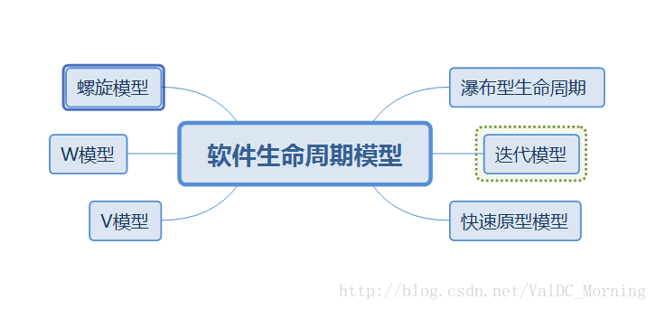

### 1) 瀑布模型

#### 生命周期

* 系统需求
* 软件需求
* 分析
* 设计
* 编码
* 测试
* 运行

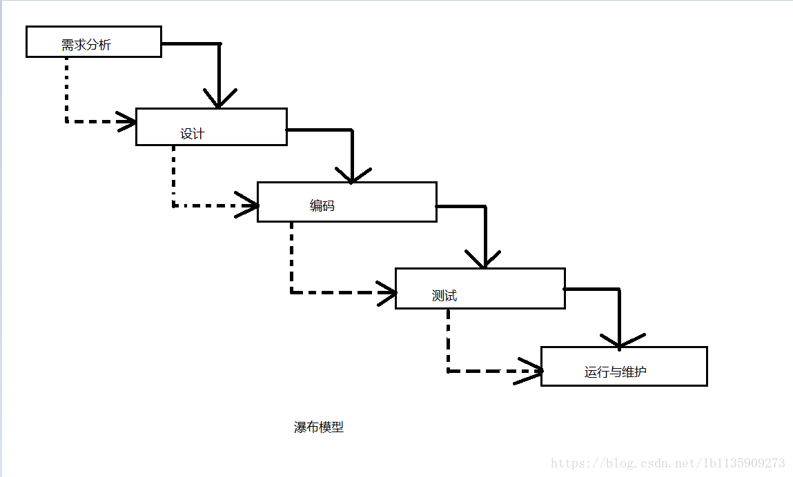

#### 使用条件

* 文档驱动的模型
* 阶段间具有顺序性和依赖性
* 项目开发周期较长
* 实际项目很少按照该模型给出的顺序进行
* 客户必须能够完整、正确和清晰地表达他们的需求

#### 优点

容易理解，管理成本低；强调开发的阶段性早起计划及需求调查和产品测试。软件项目较小

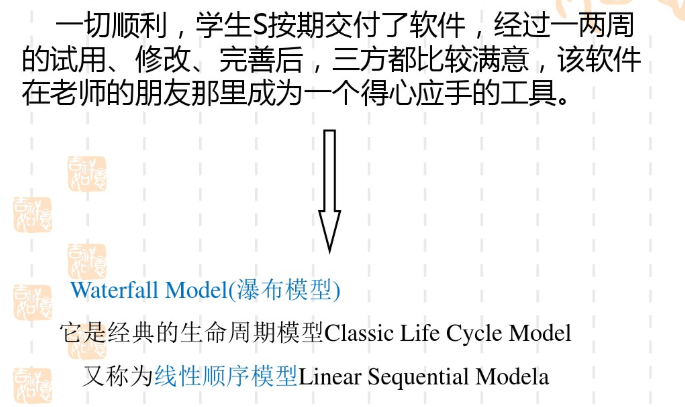

### 2) 快速原型模型

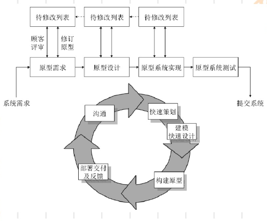

#### 步骤

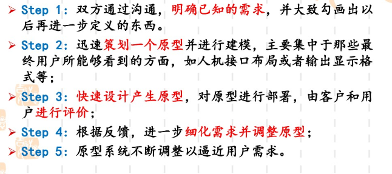

#### 特点

* 在需求定义之前，需要快速构建一个系统
* 先看界面，然后实现功能，**根据构建系统的优缺点，用户给开发人员提出反馈意见**
* 根据反馈意见修改软件需求规格，以便系统可以更正确地反映用户的需求
* 减少各种假设以及风险

#### 缺点

* 为了尽快完成原型，开发者没有考虑整体软件的质量和changing的可维护性，系统结构通常较差
* 可能混淆原型系统和最终系统
* 额外的开发费用

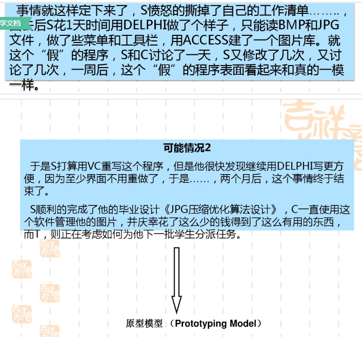

### 3) 增量模型

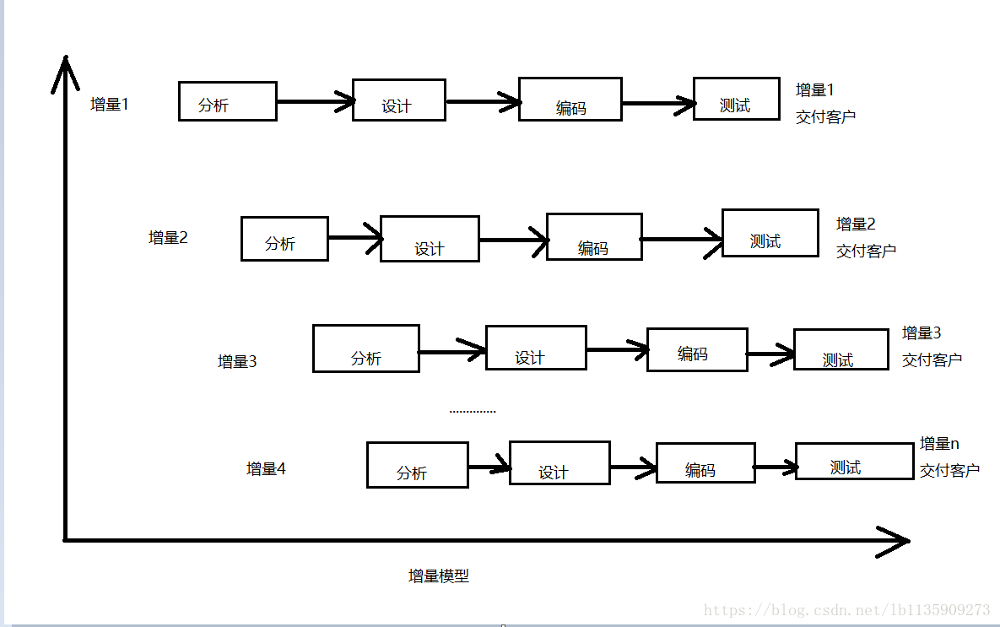

#### 优点

* **为避免一次性投资太多带来的风险**

* 融合了瀑布模型和原型的迭代特征。
* 每一个增量均发布一个可操作产品。
* 较短的时间向用户提交有用的功能
* 逐步增加产品的功能
* 项目失败风险低
* **优先级最高的服务首先交付**，意味着软件马上就能使用

#### 使用条件

+ 如果没有对用户的变更要求进行规划，那么产生的初始增量可能会造成后来增量的不稳定；

+ 如果需求不像早期思考的那样稳定和完整，那么一些增量就可能需要重新开发；

+ 管理发生的成本、进度和配置的复杂性，可能会超出组织的能力。

#### 样例

Word 字处理软件

教务系统

### 4）进化模型

这个模型可看作是重复执行的多个瀑布模型。 

### 5) 螺旋模型

>  螺旋模型将瀑布模型和演化模型结合起来，加入了两种模型均忽略的风险分析，弥补了这两种模型的不足。

#### 使用条件

* 基于风险驱动的开发模型, 使用原型法或其它方法来尽量降低风险。
* 适用于需求不明确的大规模软件项目

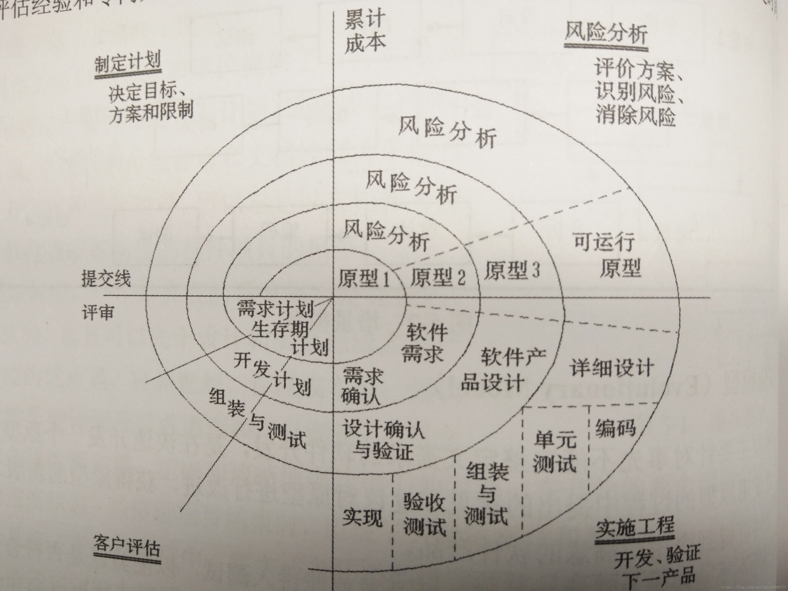

### 6) V模型

#### 使用条件

甲方提供了详细，准确的需求文档，我们的解决方案也是很明确，且安全性要求非常的严格.

## 3.3 扩展的软件开发生命周期模型

### 极限模型

> 2001年，为了避免许多公司的软件团队陷入不断增长的过程泥潭，一批业界专家一起概括出了一些敏捷开发过程的方法：SCRUM，Crystal，特征驱动软件开发（Feature Driven Development，简称FDD），自适应软件开发（Adaptive Software Development，简称ASD），以及最重要的极限编程（eXtreme Programming,简称XP）。 

极限编程将开发阶段的4个活动（**分析、设计、编码和测试**）混合在一起，在全过程中采用迭代增量开发、反馈修正和反复测试。 

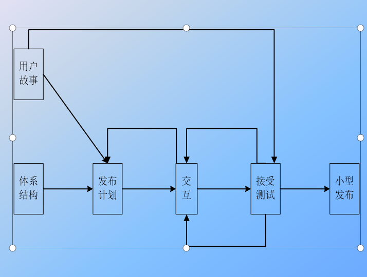

#### 核心思想

* 交流（Communication）
* 简单（Simplicity ）
* 反馈（Feedback）
* 进取（Aggressiveness）

#### 优缺点

* 优点
  * 采用简单计划策略，不需要长期计划和复杂模型，开发周期短；
  *  在全过程采用迭代增量开发、反馈修正和反复测试的方法，能够适应用户经常变化的需求。
* 缺点
  * 目前主要在小规模项目上应用并取得成功，但是否适用于中等规模或大规模软件产品，需慎重考虑；
  * 由于这个模型较新产品交付后维护成本是否降低，不能确定； 
    对编码人员的经验要求高

### Rational统一过程 （RUP）

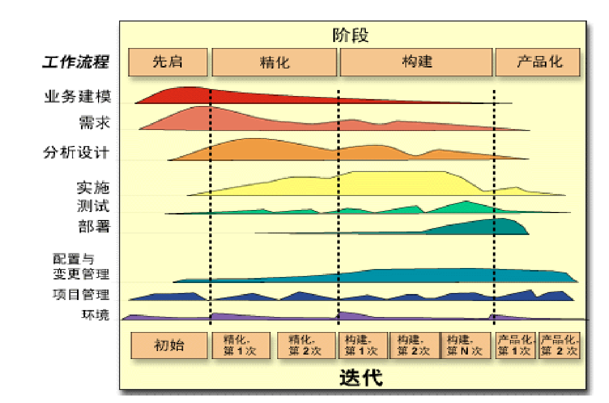

* 用例驱动
    Concise, simple, and understandable 
* 以体系结构为中心
    Effective basis for large-scale reuse
* 增量和迭代开发
    基于风险前驱的原则，渐进地展开分析、设计及其相关活动，每个迭代都会提供一次验证和调整模型机会，推动软件质量的提升。

## 3.4 质量计划

软件质量

> 是“所有描述计算机软件优秀程度的特性的组合”

软件质量度量模型有三层组成

* 质量特性
* 质量子特性
* 度量

### 质量特性

* 功能性
* 可靠性
* 易使用性
* 高效性
* 可维护性
* 可移植性

### 质量规划

> 识别哪些质量标准适用于软件项目，并确定如何满足这些标准的需求

#### 质量体系

> 指为保证产品，过程或服务质量，满足规定(或潜在)的要求，有组织机构，职责，程序，活动，能力和资源等构成的有机整体

#### 质量手册

> 描述企业质量体系的文件

#### 质量计划

> 质量管理的第一过程域

##### 质量计划内容

* 项目实施总体目标
  + 质量
  + 时间
  + 成本
* 项目分类
  + 质量倾斜型体系
  + 工期倾斜型体系
  + 成本倾斜型体系
* 软件生命周期三大阶段
  + 软件定义
  + 软件开发
  + 软件使用和维护

##### 质量计划的编写

### 质量控制

* 检测
* 控制

# 4. 软件项目团队管理

## 4.1  简介

### 概念

> 软件项目团队管理就是运用现代化的科学方法，对项目组织结构和项目全体参与人员进行管理，在项目团队中开展一系列科学规划、开发培训、合理调配、适当激励等方面的管理工作，使项目组织各方面人员的主观能动性得到充分发挥，以实现项目团队的目标。

**项目团队是软件项目中最重要的因素，成功的团队管理是软件项目顺利实施的保证**

> 软件项目开发团队是通过将不同的个体组织在一起，形成一个具有团队精神的高效率的队伍来进行软件项目的开发

### 特征

* 是一个临时性的团队
* 是跨职能的
* 在软件项目不同阶段中团队成员具有不稳定性
* 成员具有极大的流动性
* 年轻化程度高
* 软件项目团队属于高度集中的知识型团队
* 员工业绩难以量化考核
* 软件项目团队非常注重自我

### 软件项目团队管理内容

* 团队组织计划  

  指确定、记录与分派项目角色、职责，并对请示汇报关系进行识别、分配和归档。
  团队人员获取  指获得项目所需的并被指派到项目的人力资源（个人或集体）。

* 团队建设  

  既包括提高利害关系者作为个人做出贡献的能力，也包括提高项目团队作为集体发挥作用的能力。

* 个人的培养（管理能力与技术水平）

  是团队建设的基础。团队的建设是项目实现其目标的关键。

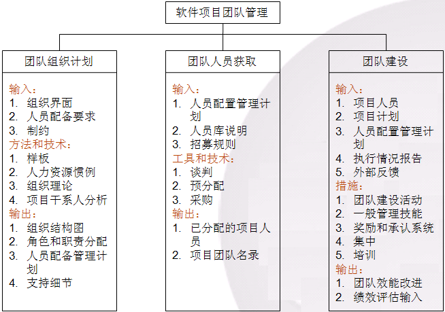

### 重要性

* 软件项目管理中至关重要的组成部分
* 有效地发挥每个参与项目的人员作用的过程
* 人员的组织管理是影响软件开发项目质量的决定性因素

## 4.2 软件项目组织计划编制

> 大多数软件项目中，组织计划是在最早的项目阶段编制的。
> 组织计划编制的结果应在整个项目过程中定期审查以保证其连续的适用性。
> 如果初始的组织编制不再有效，应及时修正。

### 1) 项目团队角色分类

* 软件项目经理  

  > 软件企业最基层的管理人员，负责分配资源、确定优先级、协调与客户之间的沟通，尽量使项目团队一直集中于正确的目标。
  > 项目经理需要领导、决策、组织、控制和创新方面的能力。

* 系统分析员  

  > 主要从事需求获取和研究，是项目中业务与技术间的桥梁。
  > 系统分析员应该善于简化工作、善于协调，并且具有良好的人际沟通和书面沟通技巧，必须具备业务和技术领域知识，需要熟悉用于获取业务需求的工具，同时还要掌握引导客户描述出需求的方法。

* 系统设计员

  > 根据软件需求说明书进行构架设计、数据库设计和详细设计，负责在整个项目中对技术活动和工件进行领导和协调。

* 软件开发人员

  > 负责按照项目所采用的标准来进行单元开发与测试。
  > 软件开发人员需要能够迅速并准确地理解系统设计员的设计文档，并能快速地进行代码开发和单元测试。

* 系统测试人员

  > 负责对测试进行计划、设计、实施和评估。

* 软件配置管理人员

  > 负责策划、协调和实施软件项目的正式配置管理活动的个人或小组。

* 质量保证人员

  > 负责计划和实施项目质量保证活动的个人或小组，以确保软件开发活动遵循软件过程标准。

### 2) 职责分配过程

> 定义和分配工作的过程是在项目启动阶段开始运作并且是重复进行的。一旦项目组决定了采用的技术方法，他们将建立一个工作分解结构图(WBS)来定义可管理的工作要素。接着，他们指定活动定义，进一步确定WBS中各个活动所包含的工作，最后指派工作。

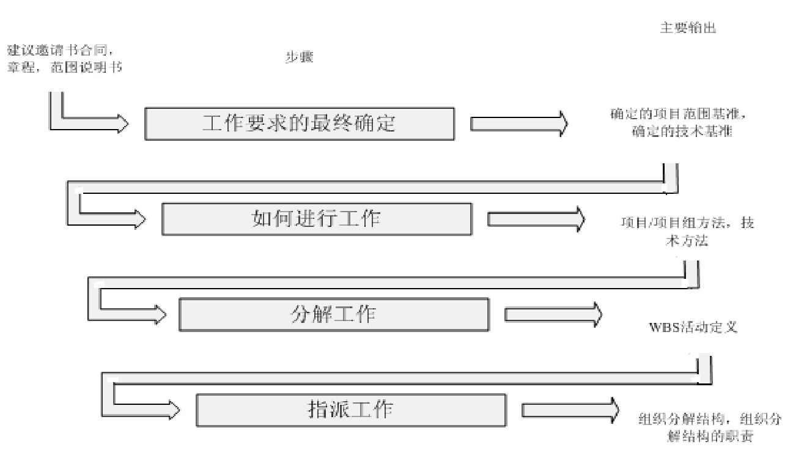

#### 1. 定义和分配工作的过程

* 确定项目要求；
* 定义工作如何完成；
* 把工作分解为可管理的部分；
* 制定工作职责。

#### 2. 组织分解结构

* OBS（组织分解结构）是一种特殊的组织结构图，它建立在一般组织结构图的基础上，根据公司各部门的具体单元或者子公司的组织单元将一般组织结构图再进行更详细地分解。
* 项目经理通常使用OBS来分配工作任务。

#### 3. 责任分配矩阵

RAM 就是将工作分解结构图(WBS)中的每一项工作指派给OBS中的执行人而形成的一个矩阵。

### 3) 项目组织结构设计

#### 1. 定义

> 项目的组织结构，是具体承担某一项目的全体职工为实现项目目标，在管理工作中进行分工协作，在职务范围、责任、权力方面所形成的结构体系。

* 组织结构的本质是员工的分工协作关系。
* 设计组织结构的目的是为了实现项目的目标。所以，组织结构是实现项目目标的一种手段。
* 组织结构的内涵是人们在职、责、权方面的结构体系。所以，组织结构又可简称为权责结构。

#### 2. 主要内容

* 职能结构，

  即完成项目目标所需的各项业务工作及其比例和关系；

* 层次结构，

  即各管理层次的构成，又称为组织的纵向结构；

* 部门结构，

  即各管理部门的构成，又称为组织的横向结构；

* 职权结构

  即各层次、各部门在权力和责任方面的分工及相互关系。

#### 3. 项目基本组织结构及其比较

在实际的项目管理中，主要有三种基本的项目组织形式——直线性、职能性和矩阵形。

##### 直线型

**优点**

可以防止多重指令和防止双头管理现象的出现，对于一个部门来说可以避免出现接收多个相互矛盾指令的情况。

**缺点**

缺少安全感

##### 职能性

> 在职能组织结构中，工作部门的设置是按照专业职能和管理业务来划分的.
> 

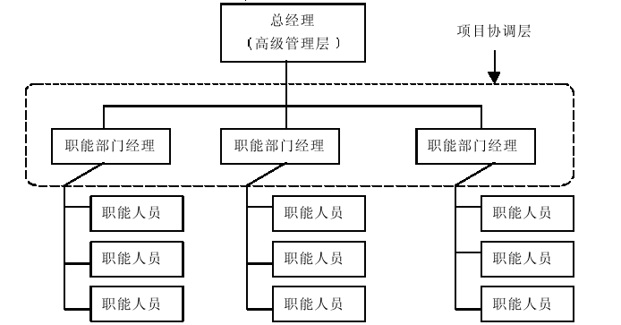1

**优点**

职能组织结构有利于发挥职能部门的专业管理作用和专业管理专长，能适应生产技术发展和间接管理复杂化的特点。

**缺点**

但如果多维指令产生冲突，则将使得下级部门无所适从，容易造成管理混乱。

**直线型组织职能结构(直线型+职能型)**

> 直线型组织职能结构在职能组织结构的基础上引入线性组织结构在命令源上单一和一致性的优点，可以防止组织中出现矛盾的指令，同时，保持线性指挥的前提下，在各级领导部门下设置相应的职能部门，分别从事各项专门业务。

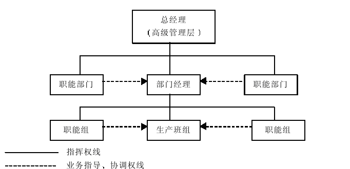

##### 矩阵型

> 矩阵组织结构的主要特点是按两大类型设置工作部门。其命令源是非线性的，因而横向管理部门和纵向管理部门各自负责的工作和管理内容必须明确。

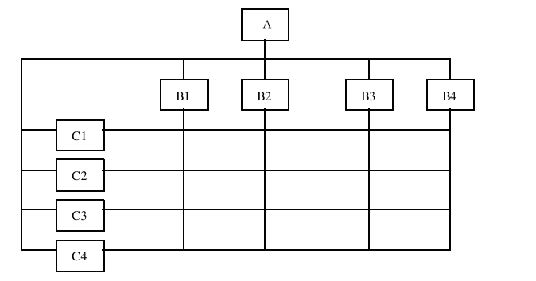

##### 比较

+ 线性组织结构特点
  + 反应迅速灵活；
  + 运营成本较低；
  + 指令唯一且责任明确；
  + 低正规化和高度集权度的结构会导致高层信息超载；
  + 随着规模的扩大制定决策变得非常缓慢；
  + 高层经理会陷入日常经营活动而无法做好长期性的资源配置工作。
+ 职能制组织形式特点
  + 在人员利用上有较大的弹性和适应性；
  + 个别专家可被不同项目利用；
  + 部门中的专家可以被组织起来共享知识和经验；
  + 在个别人离开项目甚至上级组织时仍可以保持技术上的延续性；
  + 职能部门有自己的常规工作，这些工作常常优先于项目考虑，客户常被忽略；
  + 职能部门中没有一个人对项目全权负责，不能引起对项目的高度责任感；
  + 协调性差；
  + 不易形成对项目的系统化管理系统。
+ 矩阵制、
  + 项目管理强调的重点是，项目经理个人负责管理项目以保证项目在规定费用之内按期完成；
  + 由于项目组织覆盖于职能部门之上，因此人力资源管理方便，且项目可充分利用职能部门的技术优势；
  + 对客户反应迅速；
  + 项目决策权力需要在项目组织和职能部门二者之间平衡从而带来一定困难；
  + 多个项目之间优化项目目标是矩阵制的一个优点但也由此带来项目之间的资源竞争从而互相影响；
  + 由于项目人员至少有两个上级：项目经理和职能部门经理，容易造成上级命令的不统一，从而带来管理混乱。

## 4.3 软件项目团队人员的获取

> 通过组织计划编制过程决定了软件项目所需的人员之后，需要做的就是确定如何在合适的时间获得这些人员。

### 项目经理

#### 确定条件

* 确定与指派项目经理是项目启动阶段的一个重要工作。
* 项目经理是项目组织的核心和项目团队的灵魂，对项目进行全面的管理。他的管理能力、经验水平、知识结构、个人魅力都对项目的成败起着关键的作用。
* 项目经理的工作目标是负责项目保质保量按期交付。在项目决策过程中，项目经理不仅要面对项目班子中有着各种知识背景和经历的项目管理人员，又要面对各利益相关方以及客户。

#### 要求

* 在本行业中某一技术领域中具有权威，技术过硬；
* 任务分解能力强；
* 注重对项目成员的激励和团队建设，能良好的协调项目小组成员的关系；
* 具备较强的客户人际关系能力；
* 具有很强的工作责任心，能够接受经常加班的要求；
* 应更注重管理方面的贡献，胜过作为技术人员的贡献。

### 团队人员

#### 确定条件

在项目经理确定之后，项目经理就要与公司相关人员一起商讨如何通过招聘流程获取项目所需的人力资源，这种招聘过程可以是面向内部员工，也可以面向社会人力资源。

#### 要求

* 具备特定岗位所需的不同技能，这可能是设计、编码、测试、沟通等能力；
* 适应需求和任务的变动；
* 能够建立良好的人际关系，与小组中其他成员协作；
* 能够接受加班的要求；
* 认真负责、勤奋好学，积极主动，富于创新。

## 4.4 软件团队建设

>  软件项目团队的组建工作包括：团队成员的到位和项目组内部的组织结构、角色分配和任务分工。

### 1. 要求

* 人数要求
* 技术能力要求
* 业务能力要求
* 各类人员的比例

### 2. 原则

* 人尽其才
* 公平原则
* 透明原则
* 给项目成员提供尽可能多的培训机会
* 正确处理人力资源的风险问题

### 3. 控制人员风险

* 保证开发组中全职人员的比例，且项目核心部分的工作应该尽量由全职人员来担任，以减少兼职人员对项目组人员不稳定性的影响；
* 建立良好的文档管理机制；
* 加强项目组内技术交流；
* 对于项目经理，可以从一开始就指派一个副经理在项目中协同项目经理管理项目开发工作，如果项目经理退出开发组，副经理可以很快接手。一般只建议在项目经理这样高度重要的岗位采用这种冗余制的策略来预防人员风险，否则将会大大增加项目成本；
* 为项目开发提供尽可能好的开发环境。

### 4. 团队合作

#### 1) 团队意识

> 就是团队成员为了团队的整体利益和目标而相互合作、共同努力的意愿与作风。

#### 2) 内涵

* 在团队与其成员的关系方面，团队意识表现在团队成员对团队的强烈归属感与一体感；
* 在团队成员之间的关系上，团队意识表现为成员间的相互协作从而形成有机的整体；
* 在成员对团队的事务上，团队意识表现为团队成员对团队事务的尽心尽力和全方位投入。

#### 3) 指导方针

* 避免团队目标向政治问题妥协；
* 向团队目标显示个人的承诺；
* 不用太多优先级的事物冲淡团队的工作；
* 公平,公正的对待团队成员；
* 愿意面对和解决与团队成员不良表现有关的问题；
* 对来自员工的新思维和新信息采取开放的态度。

#### 4) 团队成员

* 展示对于个人角色和责任的真实理解；
* 展示目标和以事实为基础的判断；
* 和其他团队成员有效的合作；
* 使团队目标优先于个人目标；
* 展示投身于任何项目成功所需的努力的愿望；
* 愿意分享信息、感受和产生适当的反馈；
* 当其他成员需要时给与适当的帮助；
* 展示对自己的高标准要求；
* 支持团队的决策；
* 展示直接面对重要问题的勇气和信念；
* 以为团队的成功奋斗的方式体现带头作用；
* 对别人的反馈做出积极的反映。

#### 5) 团队激励

* 激励是用人的艺术，它通过研究人的行为方式和需求心理来因势利导的激发人的工作热情，改变人的行为表现，提高个人或组织绩效。
* 软件项目团队中，激励是组织成员个人需要和项目需要的结合，一方面必须考察了解项目成员的需要，进行有针对性的激励；另一方面，必须符合项目发展的需要，进行有目的的激励。

#### 6) 需求

* 马斯洛把人的需求分为五个层次：
  + 生理需要（衣食住等）
  + 安全需要（稳定，身体安全，经济安全）
  + 社交需要（亲情，友情，归属感）
  + 尊重需要（地位和自我尊重、认可和感激）
  + 自我实现需要
* 软件人员是追求**自我实现需要**的群体，学习机会、创造是对他们主要的激励因素。对于企业来讲，软件企业的成长需要员工不断学习，永远创新，并且进行充分的团队合作。

### 5. 团队学习

* 团队学习是提高团队绩效，保持其先进性的重要举措。
* 培训可以给公司带来巨大的经济效益，提高员工的自身能力，也是提高员工工作热情和效率的重要一环。
* 学习型组织
  * 是指通过培养弥漫于整个组织的学习气氛、充分发挥员工的创造性思维能力而建立起来的一种有机的、高度柔性的、扁平的、符合人性的、能持续发展的组织。
  * 这种组织具有持续学习的能力，具有高于个人绩效总和的综合绩效。

### 6. 绩效评估管理

* 绩效评估的根本目的是为了完善工作，为了员工更好地发展。
* 按照目的划分，绩效评估的类型有：
  + 奖金分配评估
  + 提薪评估
  + 业绩评估
  + 人事评估
  + 职务评估
  + 晋升评估
* 绩效评估遵循的原则
  + 公开性原则
  + 客观、公正原则
  + 及时反馈原则
  + 敏感性原则，又称区分性原则
  + 可行性原则
  + 多层次、多渠道、全方位评价的原则
  + 绩效评估经常化、制度化的原则

# 5. 软件项目需求管理

## 5.1 概述

### 目标

按时按预算开发出满足用户真实需要的软件

### 软件需求

一个软件项目的开始阶段。在软件工程中，需求分析阶段是 包括客户、用户、业务或需求分析员、开发人员、测试人员、用户文档编写者、项目管理者和客户管理者在内的所有的风险承担者都需要参与的阶段。

#### 需求定义

> IEEE软件工程标准词汇表(1997年)中将需求定义为：
> 用户解决问题或达到目标所需的条件或权能(Capability)；
> 系统或系统部件要满足合同、标准、规范或其它正式规定文档所需具有的条件或权能；
> 一种反映上面(1)或(2)所描述的条件或权能的文档说明。

#### 需求层次

* 业务需求（business requirement）
* 用户需求（user requirement）
* 功能需求（functional requirement）
* 同时也包括非功能需求、软件需求规格说明（software requirements specification，SRS）等。

#### 需求关系

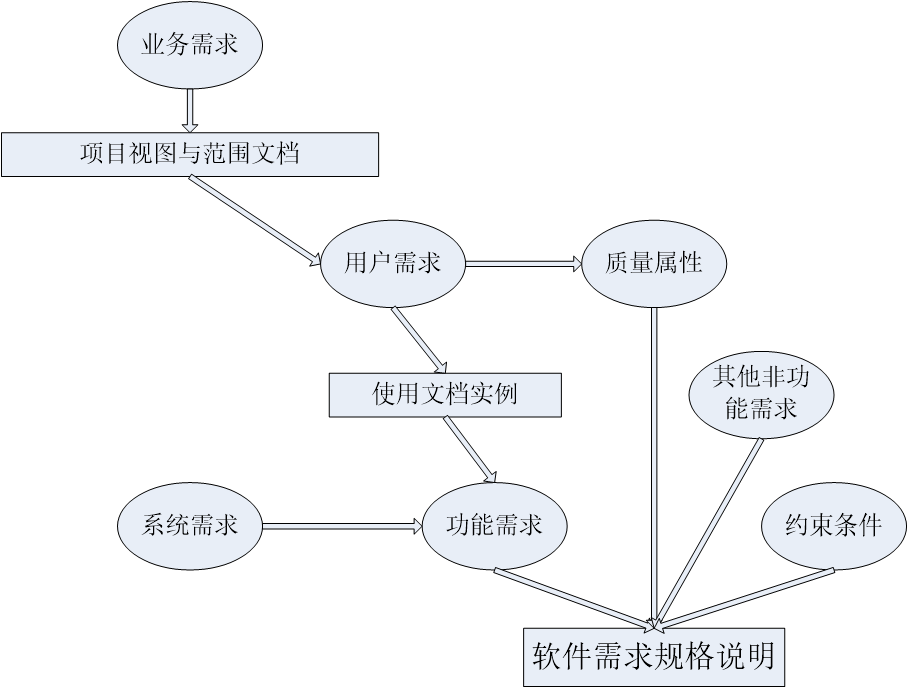

#### 需求类型

在UP（统一过程）中，软件需求是根据FURPS+模型来分类的，其中FURPS的含义如下：

* Functional（功能性）
* Usability（可用性）
* Reliability（可靠性）
* Performance（性能）
* Supportability（可支持性）
* “+”是指一些辅助性的和次要的因素： 
  + Implementation（实现）
  + Interface（接口）
  + Operations（操作）
  + Packaging(包装)
  + Legal（授权）

## 5.2 需求开发和管理过程 

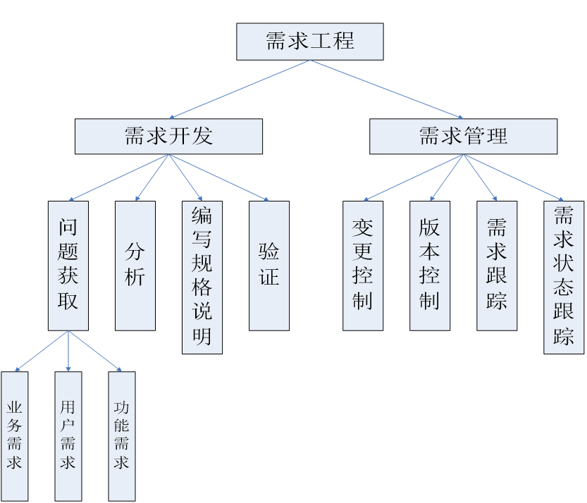

### 需求工程

  也叫做需求过程或需求阶段，包括需求开发和需  求管理。

#### 1. 需求开发

  包括**需求获取、需求分析、编写需求规格说明、验证需求**四个阶段，在这四个阶段执行以下活动：

  + 确定产品所期望的用户类；
  + 获取每个用户类的需求；
  + 了解实际用户任务和目标以及这些任务所支持的业务需求；
  + 分析源于用户的信息以区别业务需求、功能需求、质量属性、业务规则，建议解决的方法和附加的信息； 
  + 分解需求，并将需求中的一部分分配给软件组件；
  + 了解相关属性的重要性；
  + 划分实施优先级；
  + 编写需求规格说明和模型；
  + 评审需求规格，验证对用户需求的正确理解和认识。

##### 1) 需求获取

>  需求获取的主要目的是从宏观上把握用户的具体需求方向和趋势，了解现有的组织架构、业务流程、系统环境等，对任务进行分析、从而开发、捕获和修订用户的需求，以建立良好的沟通渠道和方式.

 需求获取需要执行以下活动：

+ 确定需求开发过程
+ 编写项目视图和范围文档
+ 获取涉众请求
+ 选择每类用户的产品代表
+ 建立典型的以用户为核心的队伍
+ 让用户代表确定用例
+ 召开应用程序开发联系会议
+ 分析用户工作流程
+ 确定质量属性和其它非功能需求

#####  2) 需求分析

> 需求分析包括提炼、分析和仔细审查已收集到的需求，为最终用户所看到的系统建立一个概念模型以确保所有的风险承担者都明白其含义并找出其中的错误、遗漏或其它不足的地方。

分析用户需求应该执行以下活动：

+ 绘制系统关联图
+ 创建用户接口原型
+ 分析需求可行性
+ 确定需求的优先级别
+ 为需求建立模型
+ 建立数据字典
+ 使用质量功能调配

##### 3) 需求规格说明

> 软件需求规格说明阐述一个软件系统必须提供的功能和性能以及它所要考虑的限制条件,它不仅是系统测试和用户文档的基础，也是所有子系列项目规划、设计和编码的基础。

* 需求分析完成的标志是提交一份完整的软件需求规格说明书（SRS）。
* 软件需求规格说明作为产品需求的最终成果必须包括所有的需求。
* 在开发人员的组织中要为编写软件需求文档定义一种标准模板。

**需求规格说明模板**

|                        | **1**        | **2**        | **3**                | **4**          | **5**              | **6**        |
| ---------------------- | ------------ | ------------ | -------------------- | -------------- | ------------------ | ------------ |
| a.引言                 | 目的         | 文档约定     | 预期的读者和阅读建议 | 产品的范围     | 参考文献           |              |
| b.  综合描述           | 产品的前景   | 产品的功能   | 用户类和特征         | 运行  环境     | 设计和实现上的限制 | 假设和依赖附 |
| c.  外部接口需求  附录 | 用户界面附录 | 硬件接口     | 软件接口             | 通信 接口      |                    |              |
| d.  系统特性           | 说明和优先级 | 激励响应序列 | 功能需求             |                |                    |              |
| e.  其它非  功能需求   | 性能需求     | 安全设施需求 | 安全性需求           | 软件  质量属性 | 业务规则           | 用户文       |
| f.  其它需求           |              |              |                      |                |                    |              |
| g.  附件               | 词汇表       | 分析模型     | 待确定  问题的列     |                |                    |              |

##### 4) 需求验证

> 验证是为了确保需求说明准确、无二义性并完整地表达系  统功能以及必要的质量特性。
> 需求验证要求客户代表和开发人员共同参与，对提交后的需求规格说明进行验证，分析需求的正确性，完整性以及可行性等等。

需求验证中的活动一般包括：

+ 审查需求文档
+ 以需求为依据编写测试用例
+ 编写用户手册
+ 确定合格的标准
+ 最后的签字

#### 2. 需求管理

> 是一种用于查找、记录、组织和跟踪系统需求变更的系统化方法，可用于获取、组织和记录系统需求并使客户和项目团队在系统需求变更上保持一致。
>
>  有效的需求管理在于维护清晰明确的需求阐述、每种需求类型所适用的属性，以及与其它需求和其它项目工件之间的可追踪性。

##### 需求管理活动

  内容包括

  + 定义需求基线
  + 评审需求变更并评估每项需求变更对软件产品的影响从而决定是否实施它。
  + 以一种可控制的方式将需求变更融入当前的软件项目。
    让当前的项目计划和需求保持一致。
  + 估计变更所产生的影响并在此基础上协商新的约定
    实现通过需求可跟踪对应的设计、源代码和测试用例。
  + 在整个项目过程中跟踪需求状态及其变更情况。

+ 

##### 需求变更管理

> 需求变更管理是项目管理中非常重要的一项工作。有效的需求变更管理能对变更带来的潜在影响及可能的成本费用进行评估。

需求变更管理中活动一般包括：

+ 确定需求变更控制过程
+ 建立需求变更控制委员会
+ 进行需求变更影响分析
+ 建立需求基准版本和需求控制版本文档
+ 维护需求变更的历史记录
+ 跟踪每项需求的状态
+ 跟踪所有受需求变更影响的工作产品
+ 衡量需求稳定性

## 5.3 需求获取方法

### 访谈和调研

* 和用户进行访谈和调研通常是适用于任何环境下的最重要最直接的方法之一。
* 访谈的一个主要目标是确保访谈者的偏见或主观意识不会干扰自由的交流。
* “环境无关问题”就是不涉及任何背景的问题。
* 通过几次这样的访谈，开发人员和系统分析员能获得一些问题域中的知识，对要解决的问题有进一步的理解。

### 专题讨论会

* 专题讨论会是一种可用于任何情况下的软件需求调研方法。
* 专题讨论会的目的是鼓励软件需求调研并且在很短的时间内  对讨论的问题达成一致。
* 专题讨论会一般由开发团队的成员主持，主要讨论系统应具备的特征或者评审系统特性。
* 专题讨论会前的准备工作是能否成功的举行会议的关键。

### 脑力风暴

* 脑力风暴是一种对于获取新观点或创造性的解决方案而言非常有用的方法。
*  通常，专题讨论会的一部分时间是用于进行脑力风暴，找出关于软件系统的新想法和新特征。
*  脑力风暴包括两个阶段：想法产生阶段和想法精化阶段。

### 场景串联

* 场景串联的目的是为了尽早的从用户那里得到用户对建议的系统功能的意见。
*  场景串联提供了用户界面以说明系统操作流程，它容易创建和修改，能让用户知道系统的操作方式和流程。
*  根据与用户交互的方式，场景串联被分成三种模式：静态的场景串联、动态的场景串联以及交互的场景串联。
*  选择提供哪种场景串联是根据系统的复杂性和需求缺陷的风险来确定的。

## 5.4 需求分析建模方法 

### 用例分析方法

* 简介

  > 软件需求分析者利用场景或经历来描述用户和软件系统的交互方式，并以此来获取软件需求。
  > 使用用例的分析方法来源于面向对象的思想。
  > 用例分析方法最大的特点在于面向用例，在对用例的描述中引入了外部角色的概念。

*  相关技术
  用例需求分析常常采用UML（Unified Modeling Language，统一建模语言）技术，UML是一种面向对象的建模语言。

### 原型分析方法

* 原型法是为了快速开发系统而推出的一种开发模式，旨在改进传统的结构化生命周期法的不足，缩短开发周期，减少开发风险。
* 原型法的理念
* 对原型的基本要求
* 原型法进行软件需求分析的过程
* 原型法的适用范围

### 结构化分析方法

* 结构化分析方法(Structured Method，结构化方法）

  > 是强调开发方法的结构合理性以及所开发软件的结构合理性的软件开发方法。

* 结构化的分析方法的基本步骤为： 

  + 需求分析
  + 业务流程分析
  + 数据流程分析
  + 编制数据字典
  + 结构化分析方法的优点与局限性。

## 5.5 需求管理工具

### Rational RequisitePro

### Borland Caliber

### Rational Rose

### Rational XDE

### Rational ClearCase 

## 小结

* 本章讲述了软件项目需求管理的基本概念、特点、过程，通过本章的学习，大家应该了解软件需求管理在软件项目管理中的作用与重要性，并熟悉其基本的方法。
* 软件需求包括以下几个层次：业务需求、用户需求和功能需求，也包括非功能需求、软件需求规格说明等。
* 需求过程包括需求开发和需求管理。而需求开发又包括需求获取、需求分析、编写需求规格说明、验证需求四个阶段。
* 需求获取是为了与客户建立良好的沟通渠道和方式。方法主要包括：访谈和调研、专题讨论会、脑力风暴、场景串联等。
* 需求分析包括提炼、分析和仔细审查已收集到的需求。
* 需求验证是为了确保需求说明准确、无二义性并完整地表达系统功能以及必要的质量特性。
* 常用的需求分析建模方法有用例分析方法、原型分析方法、结构化分析方法、功能列表方法等等。
* 需求管理工具中具有代表性的包括CaliberRM，DOORS，RTM，Rational RequisitePro等。

具体流程

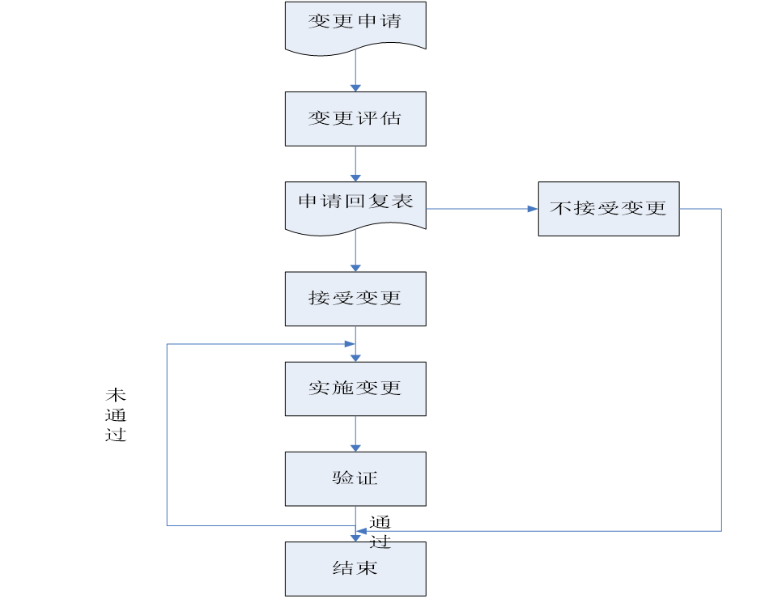

# 6. 软件项目开发计划

## 6.1 软件项目分解

### 1) 目的

明确项目所包含的各项工作；项目分解的结果就是WBS （任务分解结构）

### 2) 意义

WBS（任务分解结构）图是实施项目、创造最终产品或服务所必须进行的全部活动的一张清单，也是进度计划、人员分配、预算计划的基础

### 3) 内容

项目分解就是先把复杂的项目逐步分解成一层一层的要素（工作），直到具体明确为止

### 4) 工具

项目分解的工具是工作分解结构ＷＢＳ原理，它是一个分级的树型结构，是一个对项目工作由粗到细的分解过程

### 5) WBS(结果)

#### 内容

* Work Breakdown Structure主要是将一个项目分解成易于管理的几个部分或几个细目，以便确保找出完成项目工作范围所需的所有工作要素它是一种在项目全范围内分解和定义各层次工作包的方法

* Work Breakdown Structure结构层次越往下层则项目组成部分的定义越详细，WBS最后构成一份层次清晰，可以具体作为组织项目实施的工作依据
* WBS ——Work Breakdown Structure通常是一种面向“成果”的“树”，其最底层是细化后的“可交付成果”，该树组织确定了项目的整个范围。但WBS的形式并不限于“树”状，还有多种形式。

#### 划分

* 基于可交付成果的划分

  + 上层一般为可交付成果为导向
  + 下层一般为可交付成果的工作内容

  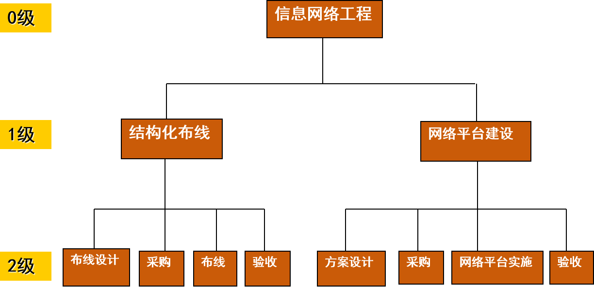

* 基于工作过程的划分

  + 上层按照工作的流程分解
  + 下层按照工作的内容划分

  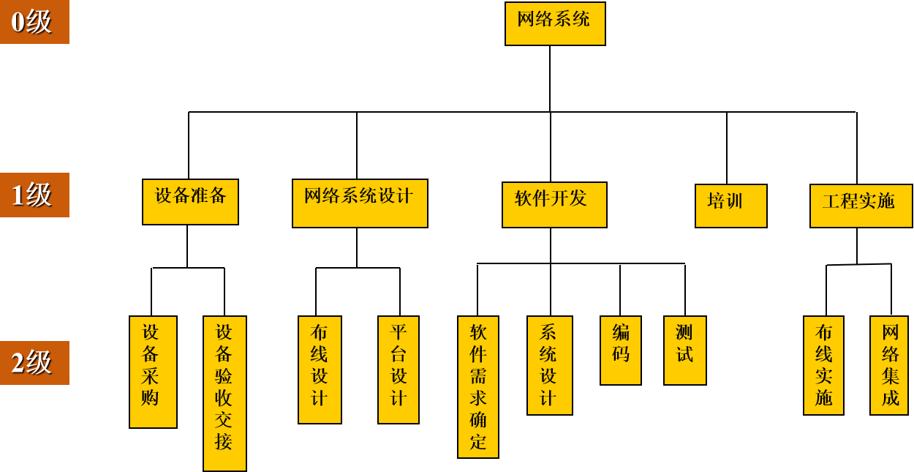

#### 表达形式

层次结构图和锯齿列表（清单）

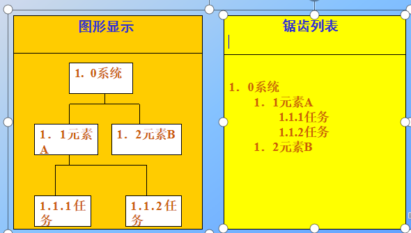

#### 工作编码

由高层向下层用多位码编排，要求每项工作有唯一的编码。

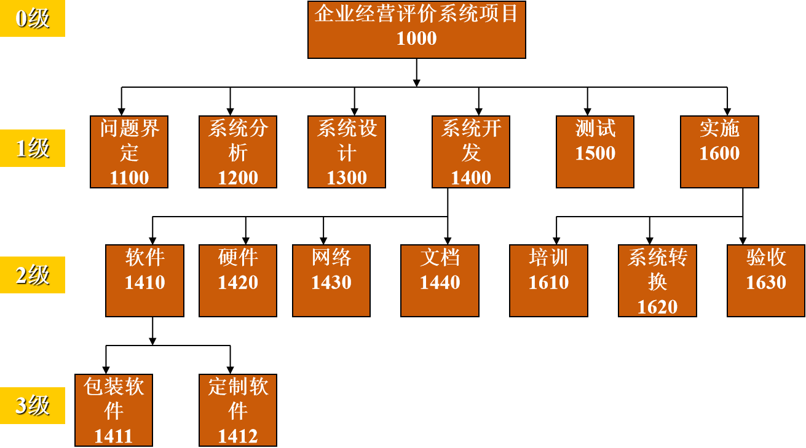

#### 步骤

* 总项目
* 子项目或主体工作任务
* 主要工作任务
* 次要工作任务
* 小工作任务或工作元素

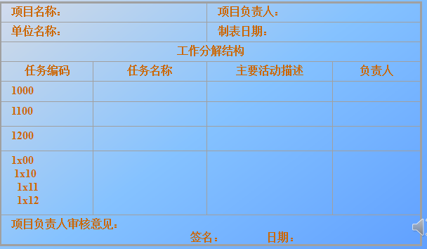

#### 注意事项

* WBS分解的规模和数量因项目而异
* 收集与项目相关的所有信息
* 参看一下类似的项目的WBS,与相关人员讨论
* 可以参照相关模板
* 最低层是可控的和可管理的，但是避免不必要的过细，最好不要超过7层，
* 软件项目推荐分解到**40**小时的任务
* 每个Work package必须有一个提交物

### 6) 步骤

* 定义任务完成的标准
* 每个WBS必须有利于责任分配
* 可以准备WBS的字典
* 最后与相关人员进行评审

## 6.2 软件项目估算

> 是指预测构造软件项目所需要的工作量以及任务经历时间的过程

### 1) 概述

* 规模（即工作量）的估算   

   确定每个软件功能所必须执行的一系列软件工程任务 

* 成本的估算   

  确定完成软件项目规模相应付出的代价 

* 进度的估算   

  估计任务的持续时间，即历时估计 

### 2) 估算方法

* 规模估算方法   

  代码行（LOC，Lines of Code）估算法、功能点（FP，Function Points）估算法和计划评审技术（PERT，Program Evaluation and Review Technique）估算法

* 成本估算方法  

  自顶向下（类比）估算法、自下而上估算法、参数估算法、专家估算法、猜测估算法等 

* 进度估算方法   

  基于规模的进度估算、工程评价技术、关键路径法、专家估算方法、类推估算方法、模拟估算方法、进度表估算方法、基于承诺的进度估算方法和Jones的一阶估算准则等 

### 3) 估算步骤

* 在技术允许的条件下，应从最详细的工作分解结构开始
* 精确定义度量的标准
* 估计底层每一模块的规模，汇总已得到总体的估算
* 适当考虑偶然因素的影响

### 4) 规模估算

#### 方法

* LOC估算法   

  代码行可以分为无注释的源代码行（NCLOC, Non-Commented Source Lines Of Code）和注释的源代码行（CLOC: Commented Source Lines Of Code），源代码的总行数LOC即为NCLOC与CLOC之和

* FP估算法   

  功能点度量是在需求分析阶段基于系统功能的一种规模估计方法，该方法通过研究初始应用需求来确定各种输入、输出、查询、外部文件和内部文件的数目，从而确定功能点数量

#### 规模单位

* LOC ( Lines of Code)
  源代码程序长度的测量
* FP (Function Point)
  用系统的功能数量来测量
* 人月
* 人天
* 人年

### 5) 成本估算

#### 方法

* 算法模型 
* 专家判定 
* 类比 
* 自顶向下 
* 自底向上

#### 模型

* 静态模型  

  用一个唯一的变量（如程序规模）作为初始元素来计算所有其他变量（如成本、时间），且所用计算公式的形式对于所有变量都是相同的

* 动态模型  

  没有类似静态模型中的惟一基础变量，所有变量都是相互依存的

**具体模型讲解**

已有的模型   1) Farr-Zagorski模型； 2) Price-S模型；3) Walston-Felix模型 ；4) Putnam模型；5) COCOMO模型 

* COCOMOⅡ模型   

  在现代软件工程研究结果的基础上，将未来软件市场划分为基础软件、系统集成、程序自动化生成、应用集成、最终用户编程五个部分，COCOMO II通过三个生命周期模型 （估算早期原型工作量的应用组合模型，早期设计模型，后体系结构模型 ）支持上述的五种软件项目。 

* Putnam模型   

  Putnam模型是Putnam于1978在来自美国计算机系统指挥部的200多个大型项目（项目的工作量在30~1000人年之间）数据的基础上推导出来的一种动态多变量模型。Putnam模型假设软件项目的工作量分布类似于Rayleigh曲线。Putnam模型包含两个方程：软件方程和人力增加方程。

* 实用软件估算模型

  是一种自下而上和参数法的结合模型，步骤如下：
  对任务进行分解
  估算每个任务i的最大值Max、最小值Min、最可能值Avg，Ei=(Max +4 Avg + Min)/6（或者使用唯一的估计值：最可能值）
  直接成本=E1+E2+……+ Ei+……+ En
  项目总估算成本= 直接成本+间接成本
  项目总报价=项目总估算成本+风险利润 
  风险利润=利润+风险基金+税

#### 成本内容

* 直接成本
  + 直接成本=开发成本+管理成本+质量成本
  + 直接成本=规模人力成本参数
  + 例如：人力成本参数=2万/人月，30人月的项目的直接成本是 60万
* 间接成本
  + 间接成本=直接成本间接成本系数
  + 间接成本= 规模人力成本参数间接成本系数
  + 例如：间接成本系数=1.5--3

#### 步骤

* 建立目标
* 规划需要的数据和资源 
* 确定软件需求
* 拟定可行的细节 
* 运用多种独立的技术和原始资料 
* 比较并迭代各个估算值 
* 随访跟踪 

#### 评价准则

* 定义
* 正确性
* 客观性
* 构造性
* 细节
* 稳定性
* 范围
* 易用性
* 可预期性
* 节约性  

### 6) 进度估算

* 基于规模的进度估算 
  定额估算法
  经验导出模型
* 工程评价技术
   利用网络顺序图的逻辑关系和加权历时估算来计算项目历时 
* 关键路径法
  它是根据指定的网络图逻辑关系进行的单一的历时估算，首先计算每一个活动的单一的、最早和最晚开始和完成日期，然后计算网络图中的最长路径，以便确定项目的完成时间估计，采用此方法可以配合进行计划的编制

### 7) 进度计划

* 进度计划定义
      ——进度是对执行的活动和里程碑制定的工作计划日期表。它决定是否达到预期目的，它是跟踪和沟通项目进展状态的依据，也是跟踪变更对项目影响的依据。
* 软件活动定义是一个过程，它涉及确认和描述一些特定的活动 
* 为了进一步制定切实可行的进度计划，必须对活动（任务）进行适当的顺序安排  
* 按时完成项目是项目经理最大的挑战之一；时间是项目规划中灵活性最小的因素
* 进度问题是项目冲突的主要原因，尤其在项目的后期

#### 1. 管理过程

* 活动定义（Activity definition）

  > 确定为完成项目的各个交付成果所必须进行的诸项具体活动
  > 完成WBS中的细目和子细目

* 活动排序（Activity sequencing）

  > 对活动进行适当的顺序安排.
  > 项目各项活动之间存在相互联系与相互依赖关系
  > 根据这些关系安排各项活动的先后顺序

* 活动历时估计（Activity duration estimating）

* 制定进度计划（Schedule development）

* 进度控制（Schedule control）-项目跟踪

#### 2. 进程管理图示

网络图、甘特图、里程碑图、资源图

##### 网络图 

> 展示项目中的各个活动以及活动之间的逻辑关系； 网络图是活动排序的一个输出；网络图可以表达活动的历时

常用网络图 ：PDM:节点法 (单代号)网络图、ADM:箭线法 (双代号)网络图、CDM:条件箭线图法

+ 在网络图中一个活动用一个方框、节点或者其他方式表示
+ 每一个活动被各种关系线相连接着
+ 将项目中的各个活动的逻辑关系表示出来
+ 网络图开始于一个任务、工作、活动、里程碑
+ 网络图结束于一个 任务、工作、活动、里程碑
+ 有些活动前置任务或者后置任务

###### PDM

(Precedence diagram )

+ 构成PDM网络图的基本特点是节点(Box)
+ 节点(Box)表示活动(工序,工作)
+ 用箭线表示各活动(工序,工作)之间的逻辑关系.
+ 可以方便的表示活动之间的各种逻辑关系
+ 没有时标
+ 在软件项目中PDM比ADM更通用

###### ADM

（Arrow diagram）

+ ADM也称为AOA （activity-on-arrow）或者双代号项目网络图
+ 在ADM网络图中,箭线表示活动(工序\工作)
+ 节点Node（圆圈:circle）表示前一道工序的结束,同时也表示后一道工序的开始
+ 只适合表示结束-开始的逻辑关系
+ 可以有时标

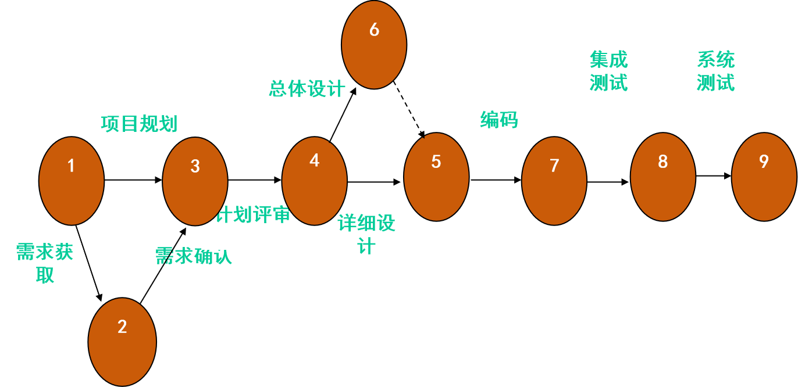

###### CDM

（condition diagram ）

+ CDM网络图也称为条件箭头图法网络图
+ CDM允许活动序列相互循环与反馈
+ 从而在绘制网络图的过程中会形成许多条件分支
+ 而在PDM、ADM中是绝对不允许的

##### 甘特图

+ 显示基本的任务信息
+ 可以查看任务的工期、开始时间和结束时间以及资源的信息
+ 只有时标，没有活动的逻辑关系
+ 有两种表示方法（棒状、三角形）

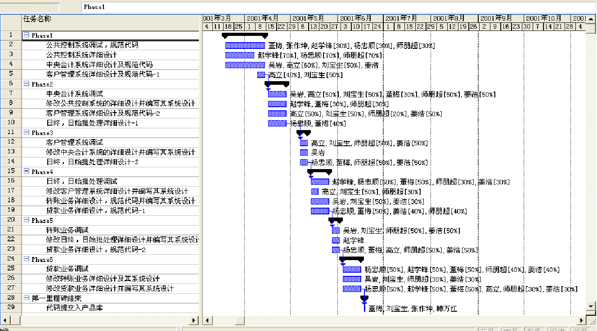

##### 里程碑图

* 里程碑显示项目进展中的重大工作完成
* 里程碑不同于活动
  活动是需要消耗资源的
  里程碑仅仅表示事件的标记

##### 资源图

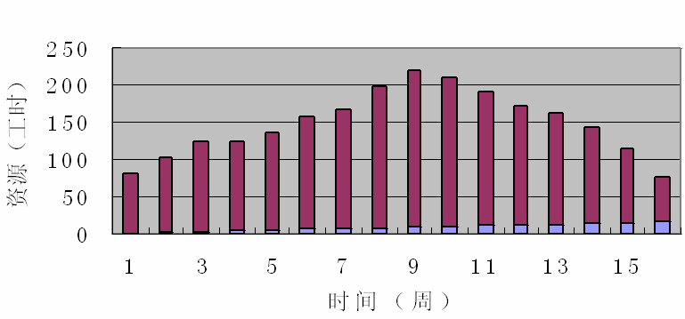

#### 3. 编制项目进度计划

* 确定项目的所有活动及其开始和结束时间
* 监控项目实施的基础，它是项目管理的基准
* 计划是三维的，考虑时间，费用和资源

#### 4. 编制项目进度计划步骤

* 进度编制
* 资源调整
* 成本预算
* 计划优化调整
* 形成基线计划

#### 5. 基本方法

* 关键路径法(CPM)

  > CPM是根据指定的网络顺序逻辑关系和单一的历时估算，计算每一个活动的单一的、确定的最早和最迟开始和完成日期
  > 计算网络图中完成时间最长的路径
  > 计算浮动时间

  + 正推法

    > 按照时间顺序计算最早开始时间和最早完成时间的方法,称为正推法

    * 首先建立项目的开始时间
    * 项目的开始时间是网络图中第一个活动的最早开始时间
    * 从左到右，从上到下进行任务编排
    * 当一个任务有多个前置时，选择其中最大的最早完成日期作为其后置任务的最早开始日期
    * 公式:
      + ES+Duration=EF
      + EF+Lag=ESs

    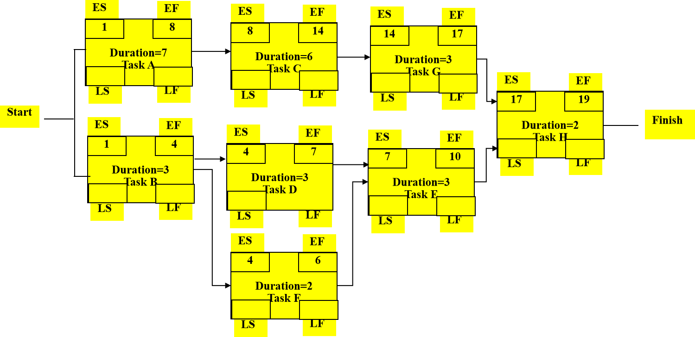

  + 逆推法

    > 按照逆时间顺序计算最晚开始时间和最晚结束时间的方法,称为逆推法. 

    + 首先建立项目的结束时间
    + 项目的结束时间是网络图中最后一个活动的最晚结束时间
    + 从右到左，从下到上进行计算
    + 当一个前置任务有多个后置任务时，选择其中最小最晚开始日期作为其前置任务的最晚完成日期
    + 公式:
      + LF-Duration=LS
      + LS-Lag=LFp

    

* 时间压缩法

  + 赶工（Crash）

  + 快速跟进（Fast tracking:搭接）

    > 改变活动间的逻辑关系，并行开展活动

*  资源调整尝试法 

#### 6. 进度编制的基本术语

**针对关键路径**

* 最早开始时间(Early start)

* 最晚开始时间(Late start)

* 最早完成时间(Early finish)

* 最晚完成时间(Late finish)

* 自由浮动（Free Float）

  > 在不影响后置任务最早开始时间本活动可以延迟的时间

* 总浮动（ Total Float）

  > 在不影响项目最早完成时间本活动可以延迟的时间

* 超前(Lead)

* 滞后(Lag)

* 浮动时间

  > 浮动时间是一个活动的机动性,它是一个活动在不影响其它活动或者项目完成的情况下可以延迟的时间量
  > Float>0：时间安排比较合理
  > Float=0：比较紧张
  > Float<0：项目进度会推迟

##### 时间参数计算

#### 7. 关键路径

* 关键路径是决定项目完成的最短时间。
* 项目整个网络图中最长的路径
* 关键路径上的任何活动延迟，都会导致整个项目完成时间的延迟
* 关键路径上的任何任务都是关键任务
* 是时间浮动为0（Float=0）的路径

##### 确定

+ 首先确定项目的网络图
+ 对网络图路径中的所有活动确定历时
+ 其中最长的路径就是 critical path

##### 注意点

* 如果关键路径上的一个活动比计划的时间长，整个项目的进度将会拖延，除非采取纠正措施
* 并不是所有的关键任务都在关键路径上
* 明确关键路径后，你可以合理安排进度
* 关键路径可能不止一条
* 在项目的进行过程中，关键路径可能改变的

#### 8. 时间压缩法

> 时间压缩法是在不改变项目范围的前提下缩短项目工期的方法

* 应急法--赶工（Crash）
  + 赶工也称为时间-成本平衡方法是在不改变活动的前提下，通过压缩某一个或者多个活动的时间来达到缩短整个项目工期的目的
  + 是在最小相关成本增加的条件下，压缩关键路经上的关键活动历时的方法

* 进度压缩单位成本计算方法
  + 进度压缩单位成本=（压缩成本-正常成本）/(正常进度-压缩进度)
  + 例如：
          任务A:正常进度7周,成本5万；压缩到5周的成本是6.2万
          进度压缩单位成本=(6.2-5)/(7-5)=6000元/周
          如果压缩到6周的成本是：5.6万

#### 9. 资源调整尝试法

+ 资源优化配置
+ 通过调整进度计划，形成平稳连续的资源需求
  + 最有效的利用资源
  + 使资源闲置的时间最小化
  + 尽量避免超出资源能力
+ 方法
  + 资源平衡，维持工期不变，使资源强度尽可能平衡
  + 在满足资源约束条件下，使工期最短
  + 将资源从非关键活动转到关键活动
  + 逆向资源分配法

* 项目成本预算

  > 分配项目成本，进行成本预算

  项目的预算成本组成：

  + 资源成本
    分配给项目中资源的成本
  + 固定成本
    是一种不因任务工期或资源完成工时的变化而变化的成本

* 成本预算的作用

  + 确保各项工作获得所需的资源
  + 是实际成本的一种控制机制
  + 为项目管理者控制项目提供一把尺子

* 分配项目成本包括三种情况

  + 分配资源成本
  + 分配固定资源成本
      例如：需要的硬件设备
  + 分配固定成本
      例如：培训任务

* 调整计划

  + 调整资源,解决资源冲突
  + 调整进度,优化项目,缩短工期
  + 调整项目成本预算,以便减少项目费用

* 解决资源冲突的方法

  + 资源调配
  + 推迟资源开始工作时间
  + 增加资源总量
  + 替换资源
  + 设置资源加班时间
  + 调整资源日历
  + 只使用资源的一部分工作时间

* 优化进度，缩短工期

  + 分解关键任务
  + 给任务增加资源
  + 缩减关键任务的工期
  + 重叠关键任务
  + 设置日历增加工作时间
  + 通过减少工时来缩减任务工期
  + 通过分配加班工时来缩短关键任务

* 调整项目成本预算

  + 降低资源的费率
  + 减少任务的工时
  + 减少资源的分配单位
  + 减少加班
  + 替换资源
  + 减少任务的固定成本
  + 删除任务

## 小结

+ 软件项目成本估算及进度管理是在软件项目的早期要开展的一项重要工作，也是软件项目管理的重要内容之一。成本估算和进度管理是制定软件项目计划的依据，对于软件项目的整个运行过程有重要意义。
+ 本章对软件项目估算和进度计划分别进行了介绍。
+ 项目规模成本估算是项目规划的基础，也是项目成本管理的核心，通过成本估算方法，分析并确定项目的估算成本，并以此为基础进行项目成本预算和计划编排，开展项目成本控制等管理活动。

# 7. 软件项目风险管理

## 7.1 概述

### 定义

* 美国软件工程研究所将风险定义为损失的可能性。风险同人们有目的的活动有关，同未来的活动有关，同人们变化的行为方式有关。风险具有两大属性：可能性和损失，可能性是风险发生的概率，损失是指预期与后果之间的差异，我们用可能性(Likelihood)和损失(Loss)的乘积来记录风险损失。风险的根源在于事物的不确定性，虽然无法避免不确定性，但是可以通过适当的方法对其进行控制与管理。
* 从范围角度上看，风险主要分为下述三种类型：**项目风险、技术风险和商业风险。** 
* 软件风险是有关软件项目、软件开发过程和软件产品损失的可能性。软件风险又可区分为软件项目风险、软件过程风险和软件产品风险。 

### 风险管理

* 风险管理是指在项目进行过程中不断对风险进行识别、评估，制定策略，监控风险的过程。通过风险识别、风险分析和风险评价去认识项目的风险，并以此为基础合理地使用各种风险应对措施、管理方法、技术和手段对项目的风险进行有效的控制，妥善处理风险事件造成的不利后果，以最小的成本保证项目总体目标的实现。

* 风险管理可以分为四个层次：    

  + 危机管理：是在风险已经造成麻烦后才着手处理它们。

  + 风险缓解：事先制定好风险发生后的补救措施，但不制定任何的防范措施。

  + 着力预防：将风险识别与风险防范作为软件项目的一部分加以规划和执行。

  + 消灭根源：识别和消灭可能产生风险的根源。

* 风险管理策略有两种：救火模式和主动模式。

### 风险管理的意义 

项目实施风险管理的意义可归纳如下：

* 通过风险分析，可加深对项目和风险的认识和理解，澄清各个方案的利弊，了解风险对项目的影响，以便减少或分散风险。
* 为以后的规划与设计工作提供反馈，以便采取措施防止与避免风险损失。
* 通过风险管理可以使决策更科学，从总体上减少项目风险，保证项目的实现。
* 可推动项目管理层和项目组织积累风险资料，以便改进将来的项目管理。

## 7.2 风险识别

### 过程

* 风险识别   

  或称风险辨识，是寻找可能影响项目的风险以及确认风险特性的过程。风险识别的目标是：辨识项目面临的风险，揭示风险和风险来源，以文档及数据库的形式记录风险。

* 风险识别的输入与输出   

  输入可能是项目的WBS、工作的陈述（Statement Of Work，SOW）、项目相关信息、项目计划假设、历史项目数据，其他项目经验文件、评审报告、公司目标等。风险识别的输出是风险列表。

* 包括以下活动   

  风险识别方法的确定 ；风险定义及分类；风险文档编写。

### 方法

* 风险条目检查表   
  + 风险条目检查表是最常用也是比较简单的风险识别方法，它是利用一组提问来帮助管理者了解项目在各方面有哪些风险。
  + 在风险条目检查表中，列出了所有可能的与每一个风险因素有关的提问，使得风险管理者集中来识别常见的、已知的和可预测的风险(如产品规模风险、依赖性风险、需求风险、管理风险及技术风险等)。 
  + 风险条目检查表一般根据风险要素进行编写，包括项目的环境、管理层的重视度、技术情况以及内部因素(如团队成员的技能或技能缺陷等)。
* 德尔菲（Delphi）法
  德尔菲方法又称专家调查法，它起源于20世纪40年代末期，最初是美国兰德公司首先使用，很快就在世界上盛行起来，目前此法的应用已遍及经济、社会、工程技术等各领域。
  我们在进行成本估算的时候也用到这种方法。用德尔菲方法进行项目风险识别的过程，是由项目风险小组选定与该项目有关的领域专家，并与这些适当数量的专家建立直接的函询联系，通过函询收集专家意见，然后加以综合整理，再匿名反馈给各位专家，再次征询意见。这样反复经过四至五轮，逐步使专家的意见趋向一致，作为最后识别的根据。 
* 情景分析法
  情景分析法是根据项目发展趋势的多样性，通过对系统内外相关问题的系统分析，设计出多种可能的未来前景，然后用类似于撰写电影剧本的手法，对系统发展态势做出自始至终的情景和画面的描述。
  当一个项目持续的时间较长时，往往要考虑各种技术、经济和社会因素的影响，对这种项目进行风险预测和识别，就可用情景分析法来预测和识别其关键风险因素及其影响程度。
* 会议法
  定期的项目组会议，如项目转折点或重要变更时举行的会议，项目月、季度总结会，项目专家会议都适宜于谈论风险信息，将风险讨论列为会议议题。  

## 7.3 风险评估

### 过程

险评估又称风险预测，就是对识别出的风险做进一步分析，对风险发生的概率进行估计和评价，对风险后果的严重程度进行估计和评价，对风险影响范围进行估计和评价，以及对于风险发生时间进行估计和评价。
风险评估可采用定性风险评估和定量风险评估来进行。

**具体过程**

+ 确定风险类别
+ 确定风险驱动因素
+ 判定风险来源
+ 定义风险度量准则
+ 预测风险影响
+ 评估风险
+ 对风险进行排序
+ 将风险分析结果归档

### 方法

* 定性风险评估
  定性风险评估主要是针对风险概率及后果进行定性的评估。
  例如采用历史资料法、概率分布法、风险后果估计法等。历史资料法主要是应用历史数据进行评估的方法，通过同类历史项目的风险发生情况，进行本项目的估算。

* 定量风险评估
  定量风险评估是一种广泛使用的管理决策支持技术。一般，在定性风险分析之后就可以进行定量风险分析。
  定量风险分析过程的目标是量化分析每一个风险的概率及其对项目目标造成的后果，也分析项目总体风险的程度。定量风险评估可以包括以下方法：

  + 访谈
  + 盈亏平衡分析
  + 决策树分析
  + 模拟法

## 7.4 风险计划

  > 定量风险评估
  >  定量风险评估是一种广泛使用的管理决策支持技术。一般，在定性风险分析之后就可以进行定量风险分析。

  定量风险分析过程的目标是量化分析每一个风险的概率及其对项目目标造成的后果，也分析项目总体风险的程度。定量风险评估可以包括以下方法：

  + 访谈
  + 盈亏平衡分析
  + 决策树分析
  + 模拟法

## 7.5 风险控制与管理

### 含义

+ 通过对风险的规划和对项目全过程的控制，保证风险管理能达到预期的目标。
+ 风险控制是项目实施过程的一个重要工作，其目的是核对风险管理的策略和实施的实际效果是否与预见相同，同时获取反馈信息，改善风险计划和管理。
+ 风险管理描述的是整个项目生存期中风险识别、风险评估、风险规划和风险控制是如何架构和执行的。在项目的进行过程中，需要不断地进行风险控制。

### 降低风险策略

* 风险规避

  风险规避是改变项目计划来消除特定风险事件的威胁。通常情况下我们可以采用多种方法来规避风险。例如，对于软件项目开发过程中存在的技术风险，我们可以采用成熟的技术，团队成员熟悉的技术或迭代式的开发过程等方法来规避风险;对于项目管理风险我们可以采用成熟的项目管理方法和策略来规避不成熟的项目管理带来的风险;对于进度风险我们可以采用增量式的开发来规避项目或产品延迟上市的风险。对于软件项目需求不确定的风险我们可以采用的原型法来规避风险。

  

* 风险转移　　

  风险转移是转移风险的后果给第三方，通过合同的约定，由保证策略或者供应商担保。软件项目通常可以采用外包的形式来转移软件开发的风险，例如发包方面对一个完全陌生领域的项目可以采用外包来完成，发包方必须有明确的合同约定来保证承包方对软件的质量，进度以及维护的保证。否则风险转移很难取得成功。

* 风险减轻　　

  风险减轻是减少不利的风险事件的后果和可能性到一个可以接受的范围。通常在项目的早期采取风险减轻策略可以收到更好的效果。例如，软件开发过程中人员流失对于软件项目的影响非常严重，我们可以通过完善工件，配备后备人员等方法来减轻人员流失带来的影响。

* 风险接受　　

  准备应对风险事件，包括积极的开发应急计划，或者消极的接受风险的后果。对于不可预见的风险，例如不可抗力;或者在风险规避，风险转移或者风险减轻不可行，或者上述活动执行成本超过接受风险的情况下采用。

# 8. 软件项目跟踪控制

##  8.1 概述

>  保证项目能够按照预先设定的计划轨道行驶，使项目不要偏离预定的发展进程。跟踪控制是一个反馈过程，需要在项目实施的全过程对项目进行跟踪控制。   

### 步骤

* 建立标准  

  即建立项目正确完成应该达到的目标

* 观察项目的性能   

  建立项目监控和报告体系，确定为控制项目所必需的数据

* 测量和分析结果  

  将项目的实际结果与计划进行比较

* 采取必要措施   

  当实际的结果同计划有误差时，必要时修正项目计划

* 控制反馈   

  如果修正计划，应该通知有关人员和部门

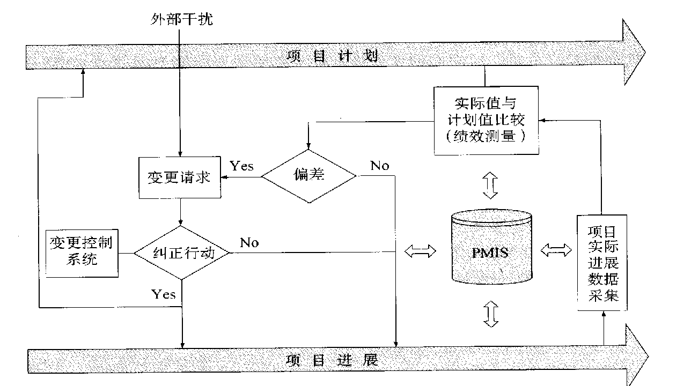

### 重要性

**不控制的危害**

+ 项目的范围会很大
+ 成本会成倍增长
+ 风险也会增加
+ 进度也会推迟

## 8.2 控制的标准

> 在对项目进行跟踪控制时，应该确定偏差的接受准则，比如进度、成本、质量等计划与实际的偏差比例等。

### 基准计划

+ 范围（质量）计划

  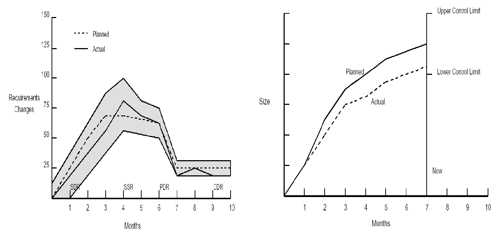

+ 进度计划

  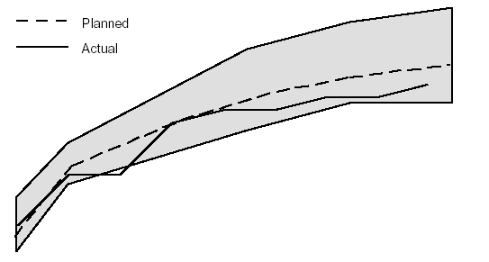

+ 成本计划

  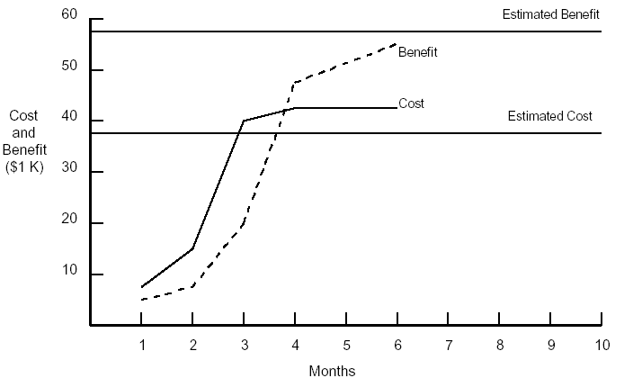

## 8.3 软件项目监控和报告体系

### 项目信息采集

> 建立项目监控和报告体系的首要任务是项目信息跟踪采集。跟踪采集是依据规定的规范对项目开发过程中的有关数据进行收集和记录，作为观察分析项目性能、标识偏差的依据。

+ 跟踪采集主要是在项目生存期内，根据项目计划中规定的跟踪频率按照规定的步骤对项目管理、技术开发和质量保证活动进行跟踪
+ 监控项目实际情况，记录反映当前项目状态的数据 
+ 项目度量实施过程

### 确定采集对象

> 采集对象主要是对项目有重要影响的内部和外部因素

+ 内部因素   指项目基本可以控制的因素，例如变更、范围、进度、成本、资源、风险等
+ 外部因素   指项目无法控制的因素，比如法律法规、市场价格、外汇牌价等
  一般要根据项目的具体情况选择采集对象。如果项目比较小，可以集中在进度、成本、资源、产品质量等内部因素；只有项目比较大的时候才可以考虑外部因素。跟踪采集的具体对象可以参见度量计划中的相关度量指标。

### 采集过程

+ 依据项目计划的要求确定跟踪频率和记录数据的方式
+ 按照跟踪频率记录实际任务完成的情况（包括进度或完成时间，质量等）
+ 按照跟踪频率记录完成任务所花费的人力和工时
+ 根据实际任务进度和实际人力投入计算实际人力成本和实际任务规模
+ 记录除人力成本以外的其他成本消耗
+ 记录关键资源的使用情况
+ 记录项目进行过程中风险发生的情况及处理对策
+ 按期按任务性质统计项目任务的时间分配情况
+ 收集其它的要求的采集信息以及必要的度量信息等

## 8.4 控制过程

### 项目监控分析对象

+ 项目范围监控
+ 项目成本监控
+ 项目进度监控
+ 项目资源监控
+ 项目质量监控
+ 项目风险监控

### 项目范围监控

其输入是软件项目的计划需求范围(即需求规格)和实际执行过程中的范围及其控制标准。在项目范围控制过程中，通过与计划的需求规格比较，如果出现范围变化，即出现增加／修改／删除部分需求范围，就需要通过范围变更控制系统来实现变更，以保证项目范围在可以接受的范围内进行。

### 范围监控注意点

> 防治不合理的范围扩张

+ 范围蔓延（ Scope Creeping ）
  客户无限制地增加需求
+ 镀金（ Gold-plating ）
  开发人员无限制地美化功能

### 项目进度、成本、资源控制

> 根据跟踪采集的进度、成本、资源等数据，并与原来的基准计划比较，对项目的进展情况进行分析，以保证项目在可以控制的进度、成本、资源内完成。

* 输入

  计划进度、成本、资源
  实际进度、成本、资源

* 方法

  图解控制法 
  挣值分析法

* 输出

  进度、成本、资源修改决定

### 项目性能分析方法

+ 图解控制法

  > 能清楚确定项目状况，但没有量化信息

  + 进度---甘特图
  + 成本—累计费用曲线图
  + 人力物力资源—资源载荷图

  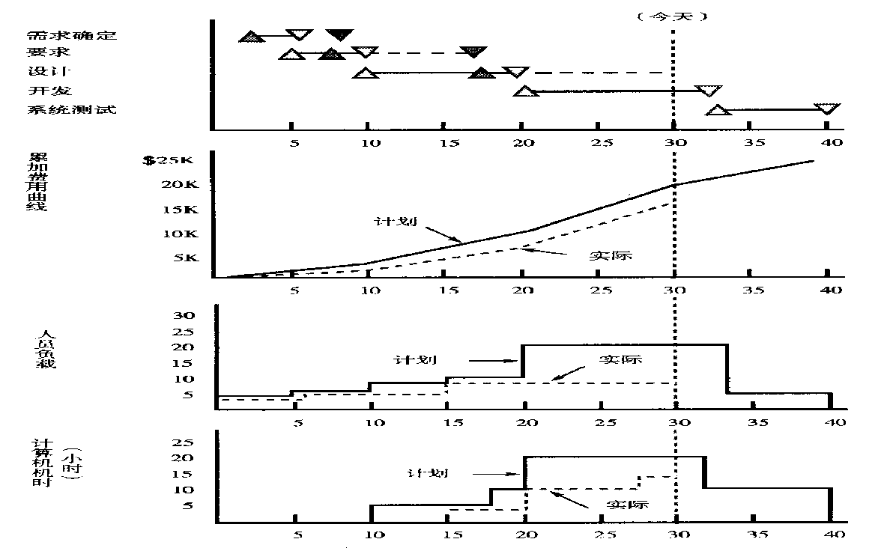

+ 挣值分析法（盈余分析法、已获取价值分析法）

  Eared Value Analysis 利用成本会计评估项目进展情况的一种方法，可以提供更多量化的信息

### 项目质量跟踪控制

> 通过质量跟踪的结果来判断项目执行过程的质量情况，决定产品是否可以接受，还是需要返工或者放弃产品。

### 项目风险的跟踪控制 

+ 实施和跟踪风险管理计划
+ 确保针对风险策略正在合理使用
+ 监视剩余的风险和识别新的风险，
+ 收集可用于将来的风险分析信息

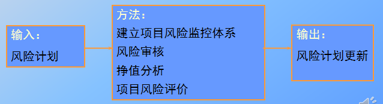

## 8.5 评审

> 项目评审是通过一定的方式对项目进行评价和审核的过程，通过项目评审，

### 评审内容

+ 进度计划
+ 质量计划
+ 配置计划
+ 风险计划
+ 沟通计划
+ 度量计划

### 评审类型

+ 按活动类别分

  + 商务评审
  + 技术评审
  + 管理评审
  + 质量评审
  + 产品评审等等

+ 按时间类别分

  + 定期评审
  + 阶段评审
  + 事件评审等等

  

### 定期评审

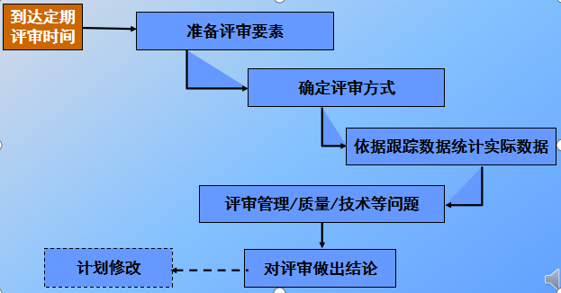

### 阶段评审

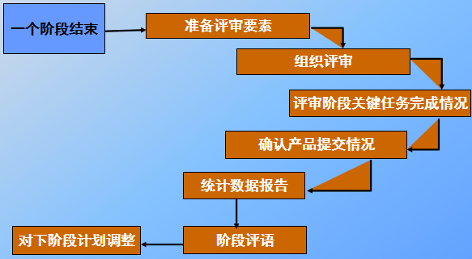

### 事情评审

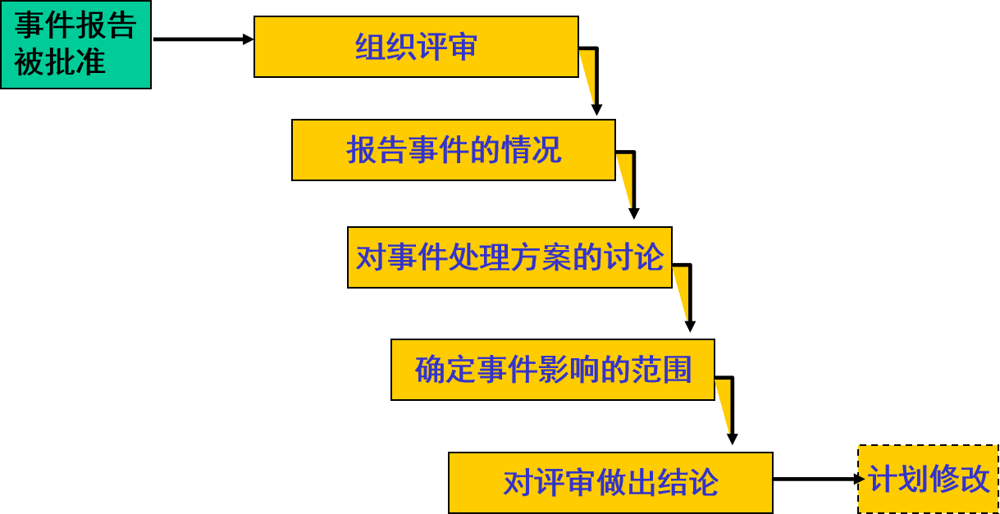

### 评审报告

> 项目评审结束后需要将评审的结果以评审报告的形式进行发布。评审报告包括定期评审报告、事件评审报告和阶段(里程碑)评审报告。

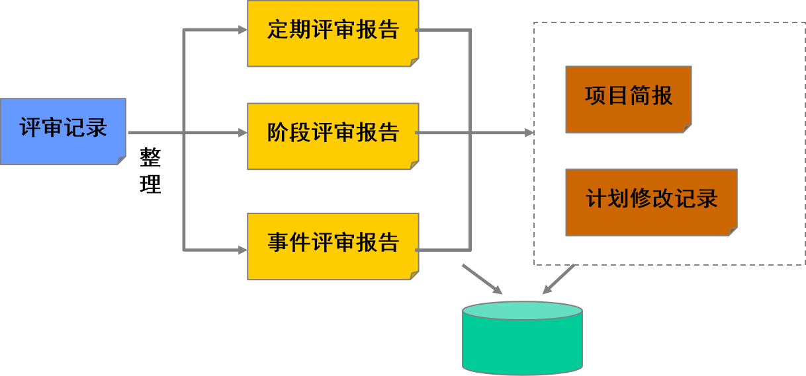

### 项目管理平台

这个系统包括四个环节，即建立基线计划、信息采集、信息处理、信息输出。

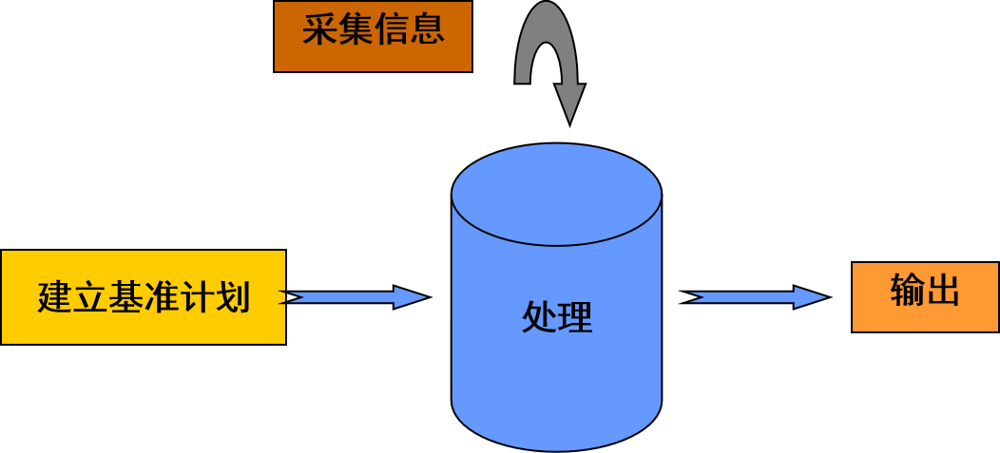

## 8.6 计划修改

根据评审结果决定是否修改项目计划
修改计划过程

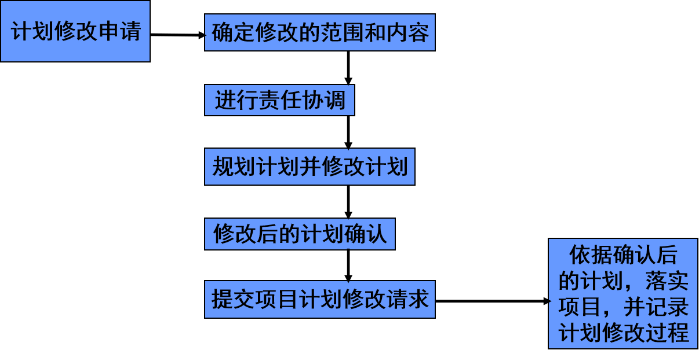

# 9. 软件项目配置管理

## 9.1 软件项目范围核实

## 9.2 软件项目配置管理概念

## 9.3 软件项目配置管理过程

## 9.4 配置管理组织与实施

# 10. 软件项目收尾

## 10.1 概述

### 项目终止的条件

* 项目计划中确定的可交付成果已经出现，项目的目标已经成功实现
* 项目已经不具备实用价值
* 项目由于各种原因而导致无限期拖长
* 项目出现了环境的变化，它负面影响项目的未来
* 项目所有者的战略发生了变化
* 项目无竞争力，难以生存

### 项目终止方式

* 终止状态
  + 绝对式终止
  + 集成式终止
  + 饥饿式终止
* 终止原因
  + 正常终止
  + 非正常终止
* 终止程度
  + 全部终止
  + 部分终止
* 终止的结果
  + 成功终止
  + 失败终止

### 成功与失败的标准

+ 项目最后执行的结果只有两个状态：成功与失败
+ 评定项目成功与失败的标准主要看三项
  + 可交付成果如何
  + 是否实现目标
  + 是否达到项目业主的期望

## 10.2 过程

### 项目文件整理

+ 鉴别未完成的工作和工序
+ 核对所有任务和活动的相关记录是否准确、齐备
+ 确认所有与项目收尾相关的资料是否完整
+ 检查项目管理计划中的工作是否实际完成
+ 完成资料的整理工作，为项目的最终移交做准备

### 项目结束过程

>  当项目接近生命期末期时，项目资源开始转向其他活动或项目，项目经理和项目团队成员所面临的工作也开始转向项目收尾活动。

* 制定项目结束计划 
* 完成收尾工作
* 项目最后评审
* 项目结束总结

### 项目结束计划

+ 项目结束要达到的目标
+ 项目结束的责任人
+ 项目结束程序
+ 项目结束的工作分解结构

### 项目收尾工作内容

* 范围确认 

  项目接收前，重新审核工作成果，检验项目的各项工作范围是否完成，或者完成到何种程度，最后，双方确认签字

* 质量验收  

  质量验收是控制项目最终质量的重要手段，依据质量计划和相关的质量标准进行验收，不合格不予接收

* 费用决算  

  费用决算是指对从项目开始到项目结束全过程所支付的全部费用进行核算，编制项目决算表的过程

* 合同终结  

  整理并存档各种合同文件

* 资料验收  

  检查项目过程中的所有文件是否齐全，然后进行归档 

### 项目最后评审

> 项目结束中一个重要的过程是项目的最后评审，它是对项目进行全面的评价和审核。

+ 是否实现项目目标
+ 是否遵循项目进度
+ 是否在预算成本内完成项目
+ 项目进度过程中出现的突发问题以及解决措施是否合适，
+ 问题是否得到解决
+ 对特殊成绩的讨论和认识
+ 回顾客户和上层经理人员的评论
+ 从该项目的实践中可以得到哪些经验和教训

### 项目结束总结

+ 总结成功的经验和失败的教训
+ 软件项目历程文件
  将项目中的有用信息进行总结分类，放入信息库，它是软件项目记录的资料
  它对将来的项目是有用的，并从中提取一般教训

## 10.3 验收

### 意义

+ 项目的验收标志着项目的结束(或阶段性结束)
+ 若项目顺利地通过验收，项目的当事人就可以终止各自的义务和责任，从而获得相应的权益。同时，项目团队可以总结经验，接受新的项目任务
+ 项目验收是保证合同任务完成，提高质量水平的最后关口
  通过项目验收，整理档案资料，可为项目最终交付成果的正常使用提供全面系统的技术文档和资料   

### 一般标准

作为项目验收的标准，一般选用项目合同书；也有选用国标、行业标准和相关的政策法规、国际惯例等。

### 主要依据

对项目进行验收时，
   主要依据项目的工作成果和成果文档。  

### 流程

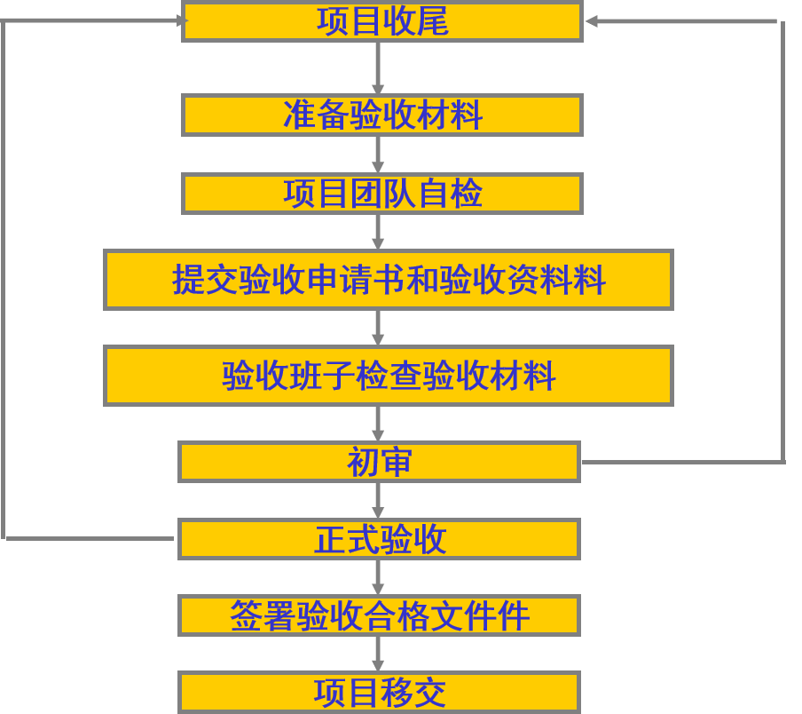

### 范围

>  从项目验收的内容划分，项目验收范围通常包括质量验收和文件验收。

+ 项目质量验收  

  项目质量永远是考查和评价项目成功与否的重要方面。一个项目的最终目的是满足客户的需求，这种需求是以质量保证为前提的，必须从项目计划、项目控制、项目验收等不同环节严把质量关

+ 项目文件验收 

  项目文件是项目整个生命周期的详细记录，是项目成果的重要展示形式。项目文件既作为项目评价和验收的标准，也是项目移交、维护和后期评价的重要原始凭证  

### 验收收尾

项目验收完成后，如果验收的成果符合项目目标规定的标准和相关的合同条款及法律法规，参加验收的项目团队和项目接收方人员应在事先准备好的文件上签字。这时项目团队与项目业主的项目合同关系基本结束，项目团队的任务转入对项目的支持和服务阶段 

### 项目移交

当项目通过验收后，项目团队将项目成果的所有权交给项目接收方，这个过程就是项目的移交 。当项目的实体移交、文件资料移交和项目款项结清后，项目移交方和项目接收方将在项目移交报告上签字，形成项目移交报告

**项目验收是项目移交的前提；移交是项目收尾的最后工作内容，是 项目管理的完结。  **

## 小结

+ 项目结束过程包括：制定结束计划、完成收尾工作、进行最后评审、编写项目总结报告等
+ 项目结束过程也非常重要，往往在整个项目接近完成的收尾阶段，项目团队成员的注意力开始转移到新的项目任务上去，并且项目收尾阶段的工作一般也比较耗时而琐碎，因此，项目收尾的重要性更应当特别强调，只有做到这一点，才会为项目真正画上一个圆满的句号。 

